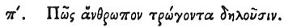

  
[Intangible Textual Heritage](../../index)  [Egypt](../index.md) 
[Index](index)  [Previous](hh152)  [Next](hh154.md) 

------------------------------------------------------------------------

[Buy this Book at
Amazon.com](https://www.amazon.com/exec/obidos/ASIN/1428631488/internetsacredte.md)

------------------------------------------------------------------------

*Hieroglyphics of Horapollo*, tr. Alexander Turner Cory, \[1840\], at
Intangible Textual Heritage

------------------------------------------------------------------------

### LXXX. HOW THEY DENOTE A MAN EATING.

 

When they would symbolise *a man eating*, they depict A CROCODILE WITH
HIS MOUTH OPEN; for he - - -

------------------------------------------------------------------------

[Next: LXXXI. How They Denote a Rapacious and Inactive Man](hh154.md)
