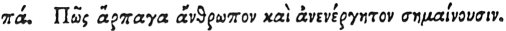

  
[Intangible Textual Heritage](../../index)  [Egypt](../index) 
[Index](index)  [Previous](hh153)  [Next](hh155) 

------------------------------------------------------------------------

[Buy this Book at
Amazon.com](https://www.amazon.com/exec/obidos/ASIN/1428631488/internetsacredte)

------------------------------------------------------------------------

*Hieroglyphics of Horapollo*, tr. Alexander Turner Cory, \[1840\], at
Intangible Textual Heritage

------------------------------------------------------------------------

p. 136

### LXXXI. HOW THEY DENOTE A RAPACIOUS AND INACTIVE MAN.

 

When they would denote *a rapacious and inactive man*, they portray a
CROCODILE WITH THE WING OF AN IBIS ON HIS HEAD; for if you touch him
with the wing of an Ibis you will find him motionless.

------------------------------------------------------------------------

[Next: LXXXII. How a Woman That Has Brought Forth Once](hh155)
