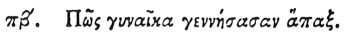

  
[Intangible Textual Heritage](../../index)  [Egypt](../index) 
[Index](index)  [Previous](hh154)  [Next](hh156) 

------------------------------------------------------------------------

[Buy this Book at
Amazon.com](https://www.amazon.com/exec/obidos/ASIN/1428631488/internetsacredte)

------------------------------------------------------------------------

*Hieroglyphics of Horapollo*, tr. Alexander Turner Cory, \[1840\], at
Intangible Textual Heritage

------------------------------------------------------------------------

### LXXXII. HOW A WOMAN THAT HAS BROUGHT FORTH ONCE.

 

When they would symbolise *a woman that has brought forth once*, they
depict A LIONESS; for she never conceives twice.

------------------------------------------------------------------------

[Next: LXXXIII. How a Man Who is at First Deformed](hh156)
