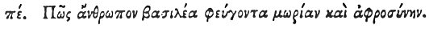

  
[Intangible Textual Heritage](../../index)  [Egypt](../index) 
[Index](index)  [Previous](hh157)  [Next](hh159) 

------------------------------------------------------------------------

[Buy this Book at
Amazon.com](https://www.amazon.com/exec/obidos/ASIN/1428631488/internetsacredte)

------------------------------------------------------------------------

*Hieroglyphics of Horapollo*, tr. Alexander Turner Cory, \[1840\], at
Intangible Textual Heritage

------------------------------------------------------------------------

### LXXXV. HOW A KING THAT FLEES FROM FOLLY AND INTEMPERANCE.

 

When they would symbolise *a king that flees from folly and
intemperance*, they delineate AN ELEPHANT [1](#fn_132) AND A RAM; for he flees at the sight of
a ram.

------------------------------------------------------------------------

### Footnotes

[138:1](hh158.htm#fr_137) Treb. cervum "a
stag."

------------------------------------------------------------------------

[Next: LXXXVI. How a King that Flees from a Trifler](hh159)
