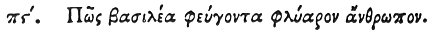

  
[Intangible Textual Heritage](../../index)  [Egypt](../index) 
[Index](index)  [Previous](hh158)  [Next](hh160) 

------------------------------------------------------------------------

[Buy this Book at
Amazon.com](https://www.amazon.com/exec/obidos/ASIN/1428631488/internetsacredte)

------------------------------------------------------------------------

*Hieroglyphics of Horapollo*, tr. Alexander Turner Cory, \[1840\], at
Intangible Textual Heritage

------------------------------------------------------------------------

### LXXXVI. HOW A KING THAT FLEES FROM A TRIFLER.

 

When they would symbolise *a king that flees from a* 

p. 139

*trifler*, they depict an ELEPHANT WITH A HOG; for he flees upon hearing
the voice of the hog.

------------------------------------------------------------------------

[Next: LXXXVII. How a Man That is Quick in his Movements, But Who Moves
Imprudently and Inconsiderately](hh160)
