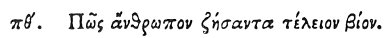

  
[Intangible Textual Heritage](../../index)  [Egypt](../index) 
[Index](index)  [Previous](hh161)  [Next](hh163) 

------------------------------------------------------------------------

[Buy this Book at
Amazon.com](https://www.amazon.com/exec/obidos/ASIN/1428631488/internetsacredte)

------------------------------------------------------------------------

*Hieroglyphics of Horapollo*, tr. Alexander Turner Cory, \[1840\], at
Intangible Textual Heritage

------------------------------------------------------------------------

### LXXXIX. HOW A MAN THAT HAS LIVED TO A PROPER AGE.

 

When they would symbolise *a man that has lived to a proper age*, they
depict a DYING CROW; for she lives an hundred years according to the
Egyptians; and a year among the Egyptians consists of four (of our)
years.

------------------------------------------------------------------------

[Next: XC. How a Man who Conceals his Depravity within Himself](hh163)
