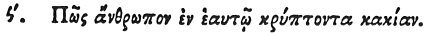

  
[Intangible Textual Heritage](../../index)  [Egypt](../index.md) 
[Index](index)  [Previous](hh162)  [Next](hh164.md) 

------------------------------------------------------------------------

[Buy this Book at
Amazon.com](https://www.amazon.com/exec/obidos/ASIN/1428631488/internetsacredte.md)

------------------------------------------------------------------------

*Hieroglyphics of Horapollo*, tr. Alexander Turner Cory, \[1840\], at
Intangible Textual Heritage

------------------------------------------------------------------------

p. 141

### XC. HOW A MAN WHO CONCEALS HIS DEPRAVITY WITHIN HIMSELF.

 

When they would denote *a man who conceals his depravity within
himself*, and hides himself so as not to be known by his own friends and
family, they depict a PANTHER; for it secretly pursues the beasts, not
suffering its scent to escape, which is \[a hindrance in the pursuit fl
of other animals.

------------------------------------------------------------------------

[Next: XCI. How a Man Deceived by Flattery](hh164.md)
