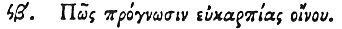

  
[Intangible Textual Heritage](../../index)  [Egypt](../index.md) 
[Index](index)  [Previous](hh164)  [Next](hh166.md) 

------------------------------------------------------------------------

[Buy this Book at
Amazon.com](https://www.amazon.com/exec/obidos/ASIN/1428631488/internetsacredte.md)

------------------------------------------------------------------------

*Hieroglyphics of Horapollo*, tr. Alexander Turner Cory, \[1840\], at
Intangible Textual Heritage

------------------------------------------------------------------------

### XCII. HOW THE PRESAGE OF A PLENTIFUL VINTAGE.

 

When they would symbolise *the presage of a plentiful vintage*, they
depict the HOU-POO; for if this bird sings \[moans?) before the season
of the vines, it is a sign of a good vintage.

------------------------------------------------------------------------

[Next: XCIII. How a Man Having Received Injury from the Grape](hh166.md)
