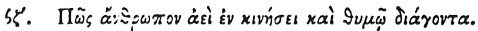

  
[Intangible Textual Heritage](../../index)  [Egypt](../index) 
[Index](index)  [Previous](hh169)  [Next](hh171) 

------------------------------------------------------------------------

[Buy this Book at
Amazon.com](https://www.amazon.com/exec/obidos/ASIN/1428631488/internetsacredte)

------------------------------------------------------------------------

*Hieroglyphics of Horapollo*, tr. Alexander Turner Cory, \[1840\], at
Intangible Textual Heritage

------------------------------------------------------------------------

### XCVII. HOW A MAN LIVING PERPETUALLY IN MOTION, AND AGITATION OF MIND.

  [1](#fn_135)

When they would symbolise *a man living perpetually* 

p. 145

*in motion, and agitation of mind, and not even remaining quiet during
meals*, they depict THE YOUNG ONES OF A CROW [1](#fn_136) \[a crow with its young\]; for whilst
she flies she feeds her young.

------------------------------------------------------------------------

### Footnotes

[144:1](hh170.htm#fr_140) Al. om.

[145:1](hh170.htm#fr_141) De Pauw sug. and
Treb. reads κορώνην νεοσσοῖς, a crow with its young.

------------------------------------------------------------------------

[Next: XCVIII. How a Man Skilled in Celestial Matters](hh171)
