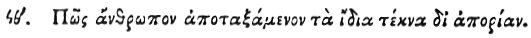

  
[Intangible Textual Heritage](../../index)  [Egypt](../index.md) 
[Index](index)  [Previous](hh171)  [Next](hh173.md) 

------------------------------------------------------------------------

[Buy this Book at
Amazon.com](https://www.amazon.com/exec/obidos/ASIN/1428631488/internetsacredte.md)

------------------------------------------------------------------------

*Hieroglyphics of Horapollo*, tr. Alexander Turner Cory, \[1840\], at
Intangible Textual Heritage

------------------------------------------------------------------------

p. 146

### XCIX. HOW A MAN WHO THROUGH WANT DISMISSES HIS OWN CHILDREN.

 

When they would symbolise *a man who through want dismisses his own
children*, they portray A HAWK WITH EGG; for though she lays three eggs,
she hatches and brings up but one, and breaks the other two: and she
does this on account of the loss of her claws at that season, being for
that reason unable to bring up all three young ones.

------------------------------------------------------------------------

[Next: C. How a Man Who is Tardy in Moving With His Feet](hh173.md)
