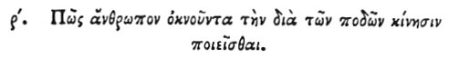

  
[Intangible Textual Heritage](../../index)  [Egypt](../index) 
[Index](index)  [Previous](hh172)  [Next](hh174) 

------------------------------------------------------------------------

[Buy this Book at
Amazon.com](https://www.amazon.com/exec/obidos/ASIN/1428631488/internetsacredte)

------------------------------------------------------------------------

*Hieroglyphics of Horapollo*, tr. Alexander Turner Cory, \[1840\], at
Intangible Textual Heritage

------------------------------------------------------------------------

p. 147

### C. HOW A MAN WHO IS TARDY IN MOVING WITH HIS FEET.

 

When they would symbolise *a man who is tardy in moving with his feet*,
they delineate A CAMEL [1](#fn_139); for this
is the only animal which bends the thigh, whence it is called
κάμηλος [2](#fn_140), a camel.

------------------------------------------------------------------------

### Footnotes

[147:1](hh173.htm#fr_144)

*It is a singular fact, that in a country like Egypt, where Camels must
have been abundant, there is no known instance of a Camel among the
existing sculptures, hieroglyphics, or paintings. Bonomi*.

[147:2](hh173.htm#fr_145) κάμηρος, Al.

------------------------------------------------------------------------

[Next: CI. How a Man Who is Impudent and Quick-Sighted](hh174)
