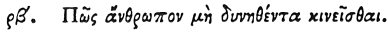

  
[Intangible Textual Heritage](../../index)  [Egypt](../index) 
[Index](index)  [Previous](hh174)  [Next](hh176) 

------------------------------------------------------------------------

[Buy this Book at
Amazon.com](https://www.amazon.com/exec/obidos/ASIN/1428631488/internetsacredte)

------------------------------------------------------------------------

*Hieroglyphics of Horapollo*, tr. Alexander Turner Cory, \[1840\], at
Intangible Textual Heritage

------------------------------------------------------------------------

### CII. HOW A MAN UNABLE TO MOVE HIMSELF.

 

When they would symbolise *a man who for a long time is unable to move
himself, but who afterwards moves with his feet*, they depict A FROG
HAVING ITS HIND FEET; for it is born without feet, but subsequently as
it grows acquires its hind feet.

------------------------------------------------------------------------

[Next: CIII. How a Man Hostile to All](hh176)
