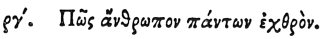

  
[Intangible Textual Heritage](../../index)  [Egypt](../index) 
[Index](index)  [Previous](hh175)  [Next](hh177) 

------------------------------------------------------------------------

[Buy this Book at
Amazon.com](https://www.amazon.com/exec/obidos/ASIN/1428631488/internetsacredte)

------------------------------------------------------------------------

*Hieroglyphics of Horapollo*, tr. Alexander Turner Cory, \[1840\], at
Intangible Textual Heritage

------------------------------------------------------------------------

p. 149

### CIII. HOW A MAN HOSTILE TO ALL.

 

When they would symbolise *a man that is hostile to, and secluded from,
all men*, they depict AN EEL; for it is found associating with no other
fishes.

------------------------------------------------------------------------

[Next: CIV. How a Man Who Saves Many in the Sea](hh177)
