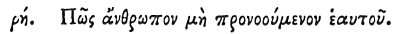

  
[Intangible Textual Heritage](../../index)  [Egypt](../index) 
[Index](index)  [Previous](hh180)  [Next](hh182) 

------------------------------------------------------------------------

[Buy this Book at
Amazon.com](https://www.amazon.com/exec/obidos/ASIN/1428631488/internetsacredte)

------------------------------------------------------------------------

*Hieroglyphics of Horapollo*, tr. Alexander Turner Cory, \[1840\], at
Intangible Textual Heritage

------------------------------------------------------------------------

### CVIII. HOW A MAN THAT DOES NOT PROVIDE FOR HIMSELF.

 

When they would symbolise *a father, or a man who* 

p. 152

*does not provide for himself, but is provided for by his domestics*,
they depict A PINNA AND A CRAYFISH; for this crayfish remains adhering
to the flesh of the pinna, and is called pinnophylax (protector of the
pinna), and acts agreeably with its name. For the pinna when hungry
always opens her shell, and when, whilst she lies gaping, any little
fish comes within it, the pinnophylax pinches the pinna with its claw,
which when the pinna perceives, she closes her shell, and thus catches
the little fish.

------------------------------------------------------------------------

[Next: CIX. How a Man Addicted to Gluttony](hh182)
