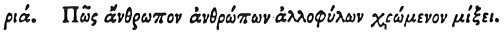

  
[Intangible Textual Heritage](../../index)  [Egypt](../index.md) 
[Index](index)  [Previous](hh183)  [Next](hh185.md) 

------------------------------------------------------------------------

[Buy this Book at
Amazon.com](https://www.amazon.com/exec/obidos/ASIN/1428631488/internetsacredte.md)

------------------------------------------------------------------------

*Hieroglyphics of Horapollo*, tr. Alexander Turner Cory, \[1840\], at
Intangible Textual Heritage

------------------------------------------------------------------------

### CXI. HOW A MAN THAT HAS COMMERCE WITH PERSONS OF ANOTHER TRIBE.

 

When they would symbolise *a man that has commerce with persons of
another tribe*,

p. 154

they depict the LAMPREY; because it ascends out of the sea, and has
commerce with the vipers, and straightway returns to the sea.

------------------------------------------------------------------------

[Next: CXII. How a Man Punished for Murder](hh185.md)
