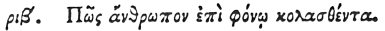

  
[Intangible Textual Heritage](../../index)  [Egypt](../index.md) 
[Index](index)  [Previous](hh184)  [Next](hh186.md) 

------------------------------------------------------------------------

[Buy this Book at
Amazon.com](https://www.amazon.com/exec/obidos/ASIN/1428631488/internetsacredte.md)

------------------------------------------------------------------------

*Hieroglyphics of Horapollo*, tr. Alexander Turner Cory, \[1840\], at
Intangible Textual Heritage

------------------------------------------------------------------------

### CXII. HOW A MAN PUNISHED FOR MURDER.

 

When they would symbolise *a man punished for murder and repenting*,
they depict a PARTINACA (a fish with a sting in its tail,) CAUGHT ON A
HOOK; for when caught it casts away the sting in its tail.

------------------------------------------------------------------------

[Next: CXIII. How a Man that Eats Unsparingly of Another's
Substance](hh186.md)
