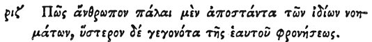

  
[Intangible Textual Heritage](../../index)  [Egypt](../index.md) 
[Index](index)  [Previous](hh189)  [Next](hh191.md) 

------------------------------------------------------------------------

[Buy this Book at
Amazon.com](https://www.amazon.com/exec/obidos/ASIN/1428631488/internetsacredte.md)

------------------------------------------------------------------------

*Hieroglyphics of Horapollo*, tr. Alexander Turner Cory, \[1840\], at
Intangible Textual Heritage

------------------------------------------------------------------------

p. 157

### CXVII. HOW A MAN PREVIOUSLY DERANGED IN HIS INTELLECTS, BUT AFTERWARDS BECOMING SANE.

 

When they would symbolise *a man previously deranged in his intellects,
but afterwards becoming sane, and bringing a degree of regularity into
his life*, they depict a SYRINX; for it is soothing, and calls to
remembrance things that have been pleasurably done; and it produces a
very regulated sound.

------------------------------------------------------------------------

[Next: CXVIII. How a Man Who Distributes Justice Impartially to
All](hh191.md)
