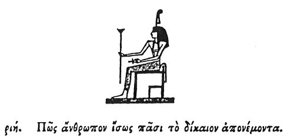

  
[Intangible Textual Heritage](../../index)  [Egypt](../index) 
[Index](index)  [Previous](hh190)  [Next](hh192) 

------------------------------------------------------------------------

[Buy this Book at
Amazon.com](https://www.amazon.com/exec/obidos/ASIN/1428631488/internetsacredte)

------------------------------------------------------------------------

*Hieroglyphics of Horapollo*, tr. Alexander Turner Cory, \[1840\], at
Intangible Textual Heritage

------------------------------------------------------------------------

p. 158

### CXVIII. HOW A MAN WHO DISTRIBUTES JUSTICE IMPARTIALLY TO ALL.

  [1](#fn_141)

When they would symbolise *a man who distributes justice impartially to
all*, they depict THE FEATHER OF AN OSTRICH; for this bird has the
feathers of its wings equal on every side, beyond all other birds.

------------------------------------------------------------------------

### Footnotes

[158:1](hh191.htm#fr_146)

*Tme, the goddess of Justice; the Themis of the Greeks. Justice is
denoted by the ostrich's feather; with which the head of the goddess is
ornamented*.

------------------------------------------------------------------------

[Next: CXIX. How a Man That is Fond of Building](hh192)
