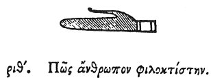

  
[Intangible Textual Heritage](../../index)  [Egypt](../index) 
[Index](index)  [Previous](hh191)  [Next](hh193) 

------------------------------------------------------------------------

[Buy this Book at
Amazon.com](https://www.amazon.com/exec/obidos/ASIN/1428631488/internetsacredte)

------------------------------------------------------------------------

*Hieroglyphics of Horapollo*, tr. Alexander Turner Cory, \[1840\], at
Intangible Textual Heritage

------------------------------------------------------------------------

p. 159

### CXIX. HOW A MAN THAT IS FOND OF BUILDING.

  [1](#fn_142)

When they would symbolise *a man that is fond of building*, they
delineate A MAN'S HAND; for it performs all works.

 

 

Ὡραπόλλωνος Νειλώου ἱερογλυφικῶν τέλος

THE END OF THE HIEROGLYPHICS OF HORAPOLLO NILOUS.

 

 

 

------------------------------------------------------------------------

### Footnotes

[159:1](hh192.htm#fr_147)

*A Hand signifies a hand, also the letters T, Th, or D*.

------------------------------------------------------------------------

[Next: Appendix](hh193)
