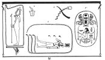
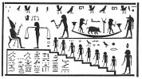
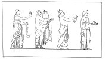

  
[Intangible Textual Heritage](../../index)  [Egypt](../index.md) 
[Index](index)  [Previous](hh192)  [Next](hh194.md) 

------------------------------------------------------------------------

[Buy this Book at
Amazon.com](https://www.amazon.com/exec/obidos/ASIN/1428631488/internetsacredte.md)

------------------------------------------------------------------------

*Hieroglyphics of Horapollo*, tr. Alexander Turner Cory, \[1840\], at
Intangible Textual Heritage

------------------------------------------------------------------------

p. 160p. 161

# APPENDIX.

### EXPLANATION OF THE PLATES.

The FRONTISPIECE is a Ptolemaic doorway, with the supreme god, Ammon,
upon its piers, holding in one hand the staff of power, and in the other
the emblem of life. The sacred symbol of the. Winged Globe and Serpent
is upon the architrave: and a continuous row of serpents forms .an attic
above the cornice. The symbol in the centre signifies "Hieroglyphics."

p. 162

### PLATE I.

Fig. I. is a representation of the god Atmou surrounded by a serpent
with his tail in his mouth, and is given by Dr. Leemans in illustration
of book I. chapter 2.

II\. Is an illustration of the same chapter; it occurs on a sarcophagus
in the British Museum.

III\. Is from a scarab seal in the possession of J. Millingen, Esq. It
is a representation of Netpe holding two palm branches indicative of the
year, and seems to imply that the calendar was reformed by Thothmos III.
whose signet occupies the upper half. See chapter 12.

IV\. A lamp or pot of fire, signifies the letter B, and may be an
illustration of chapter 22.

V. This has not unfrequently been considered. an illustration of book I.
chapter 43; but is extremely doubtful.

p. 163

[  
Click to enlarge](img/pl01.jpg.md)  
Plate I  

p. 164

### PLATE II.

This plate, sketched by Mr. Bonomi, from a tomb in Thebes, represents a
judgment scene in which, as explained by Champollion, different souls
are ascending the steps to judgment by Osiris. The soul of a glutton
last condemned is departing in the boat in the form of a swine. See book
II. chapter 37: and for the inverted stags’ heads, which seem to have
some connection with eternity, see book I. chapter 69, and book II.
chapter 21. A similar judgment scene appears upon the sarcophagus from
Belzoni's tomb in Sir J. Soame's museum.

[  
Click to enlarge](img/pl02.jpg.md)  
Plate II  

[  
Click to enlarge](img/pl03.jpg.md)  
Plate III  

p. 165

### PLATE III.

It is evident that in the chapters, 37, 38, 39, 40, 41, and 42, of the
first Book, Horapollo must have had in view one of the ceremonial
processions of the Egyptian priests.

The plate, a copy of a basso relievo of Roman date, given in Bartoli's
Admiranda, represents a similar procession. The following passage from
Clemens of Alexandria throws considerably more light upon the subject:

 

The Egyptians possess a certain native philosophy of their own, and this
their sacred ceremonies principally shew. For first proceeds a *Singer*
bearing some of the symbols of music: and they say that his duty is to
be versed in the two books of Hermes, one of which contains the hymns of
the gods, and the other precepts for the regulation of the king's life.
After the singer comes the *Horoscopus* holding

p. 166

in his hand a clock and a palm branch, the symbols of astrology. His
duty is constantly to retain in memory the astrological books of Hermes,
which are four in number: of these one treats of the disposition of the
apparently fixed stars, another of the conjunctions and illuminations of
the sun and moon, and the remaining ones of their rising. After him
proceeds the sacred Scribe, having wings upon his head, and in his hands
a book and rule containing ink and the reed with which they write. His
duty is to be acquainted with what are called hieroglyphics, relating to
cosmography, geography, the positions of the sun and moon, the five
planets, the topography. of Egypt, the Nile, and its adjacent shores;
comprising also a description of the attire of the priests, and of the
places set apart for them, and

p. 167

concerning the measures and other matters appertaining to the priests.
After the preceding, follows the *Stolistes* (the Master of the Robes,)
holding the rod of justice and the chalice. His duty is to be versed in
all things relating to education, and the rites called "the sacrifice of
the calf." Ten of these \[books\] relate to the worship of their gods
and the Egyptian religion, viz. such as concern the sacrifices, first
fruits, hymns, prayers, processions, festivals, and the like. Last of
all comes the *Prophet* openly carrying in his bosom the waterpot: and
he is followed by the supervisors of the exportation of bread. His duty
as president of the temple is to be conversant with the ten books called
hieratic. These contain all things relating to the laws and the gods,
and the entire ordinances respecting sacred

p. 168

matters. For among the Egyptians the prophet presides over the
distribution of the revenue; hence there are forty-two books of Hermes
which are absolutely necessary. Of these, thirty-six, containing all the
philosophy of the Egyptians, are learned by the above-mentioned
officers: the remaining six, relating to medicine and the constitution
of the body, and to its diseases and organs, and to pharmacy and the
eyes, and lastly to woman, are learned by the pastophori.—*Clemens.
Strom*. VI. 633.

 

p. 169

The following passages from Clemens of Alexandria and Porphyry are
illustrative of the different kinds of writing anciently practised in
Egypt. The passage of Clemens is found to be strictly in accordance with
the result of modern discoveries, which have brought to light the
Enchorial, Hieratic, and Hieroglyphic inscriptions, and the different
species of Hieroglyphics.

### FROM CLEMENS.

Now those who are instructed by the Egyptians, first of all learn that
system of Egyptian writing, which is called the EPISTOLOGRAPHIC \[or
enchorial\]; secondly, the HIERATIC, which is used by the sacred
scribes; thirdly and lastly, the HIEROGLYPHIC. Of this \[last\] one kind
expresses its own meaning *by the first elements* \[*alphabetically*\];
but the other kind is *symbolical*. Of the symbolical, one sort directly
conveys its meaning by *imitation*;

p. 170

another sort is written as it were *metaphorically*; while the remaining
sort speaks *allegorically* as it were by means of (enigmas. Thus,
\[Imitatively,\] when they would indicate the Sun they make a CIRCLE,
and the *moon*, a CRESCENT by a form which conveys its own
signification. But Metaphorically, they adopt some appropriate turn or
transfer in their engravings, simply changing some things, but
multifariously transforming others: thus in expressing the praises of
their kings they invest them with the mythological attributes of the
gods, by a transfer of their symbols. But of the third form, the
Enigmatical, let this serve as an example: some of the stars, on account
of the obliquity of their courses they portray by the bodies of
Serpents; but the Sun by that of a Beetle, because it forms a globe of
cow-dung, rolling it with its

p. 171

face averted: they say also that this creature lives six months under
ground, but the other portion of the year above ground; that it
propagates by vivifying the beforementioned globe; and that no female
beetle is ever born.—*Strom*. V. 555.

### FROM PORPHYRY.

Pythagoras travelled also among the Egyptians; and in Egypt he lived
with the priests, and learned from them the wisdom and language of the
Egyptians, and the three kinds of writing, viz. the *epistolographic*,
the *hieroglyphic*, and the *symbolic*, the one conveying its meaning
directly by imitation, the other allegorically, by means of ænigmas. *De
Vit. Pyth*. p. 8.

------------------------------------------------------------------------

[Next: Index of the Abbreviations Used](hh194.md)
