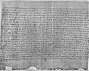

  
[Intangible Textual Heritage](../../index)  [Egypt](../index) 
[Index](index)  [Previous](leg03)  [Next](leg05) 

------------------------------------------------------------------------

p. xii

 [  
Click to enlarge](img/i01200.jpg)  
THE HISTORY OF CREATION. (Brit. Mus. Papyrus No 10,188).

p. xiii

# INTRODUCTION

### I.

### THE LEGEND OF THE GOD NEB-ER-TCHER, AND THE HISTORY OF CREATION.

THE text of the remarkable Legend of the Creation which forms the first
section of this volume is preserved in a well-written papyrus in the
British Museum, where it bears the number 10,188. This papyrus was
acquired by the late Mr. A. H. Rhind in 1861 or 1862, when he was
excavating some tombs on the west bank of the Nile at Thebes. He did not
himself find it in a tomb, but he received it from the British Consul at
Luxor, Mustafa Agha, during an interchange of gifts when Mr. Rhind was
leaving the country. Mustafa Agha obtained the papyrus from the famous
hiding-place of the Royal Mummies at Der-al-Bahari, with the situation
of which he was well acquainted for many years before it became known to
the Egyptian Service of Antiquities. When Mr. Rhind came to England, the
results of his excavations were examined by Dr. Birch, who, recognising
the great value of the papyrus, arranged to publish it in a companion
volume to *Facsimiles of Two Papyri*, but the death of Mr. Rhind

p. xiv

in 1865 caused the project to fall through. Mr. Rhind's collection
passed into the hands of Mr. David Bremner, and the papyrus, together
with many other antiquities, was purchased by the Trustees of the
British Museum. In 1880 Dr. Birch suggested the publication of the
papyrus to Dr. Pleyte, the Director of the Egyptian Museum at Leyden.
This savant transcribed and translated some passages from the *Festival
Songs of Isis and Nephthys*, which is the first text in it, and these he
published in *Recueil de Travaux*, Paris, tom. iii., pp. 57-64. In 1886
by Dr. Birch's kindness I was allowed to work at the papyrus, and I
published transcripts of some important passages and the account of the
Creation in the *Proceedings of the Society of Biblical Archaeology*,
1886-7, pp. 11-26. The Legend of the Creation was considered by Dr. H.
Brugsch to be of considerable value for the study of the Egyptian
Religion, and encouraged by him [1](#fn_0) I made
a full transcript of the papyrus, which was published in *Archaeologia*,
(vol. lii., London, 1891), with transliterations

p. xv

and translations. In 1910 I edited for the Trustees of the British
Museum the complete hieratic text with a revised translation. [1](#fn_1)

The papyrus is about 16 ft. 8 in. in length, and is 9¼ in. in width. It
contains 21 columns of hieratic text which are written in short lines
and are poetical in character, and 12 columns or pages of text written
in long lines; the total number of lines is between 930 and 940. The
text is written in a small, very black, but neat hand, and may be
assigned to a time between the XXVIth Dynasty and the Ptolemaic Period.
The titles, catch-words, rubrics, names of Apep and his fiends, and a
few other words, are written in red ink. There are two colophons; in the
one we have a date, namely, the "first day of the fourth month of the
twelfth year of Pharaoh Alexander, the son of Alexander," i.e., B.C.
311, and in the other the name of the priest who either had the papyrus
written, or appropriated it, namely, Nes-Menu, or Nes-Amsu.

The Legend of the Creation is found in the third work which is given in
the papyrus, and which is called the "Book of overthrowing Apep, the
Enemy of Ra, the Enemy of Un-Nefer" (i.e., Osiris). This work contained
a series of spells which were recited during the performance of certain
prescribed ceremonies,

p. xvi

with the object of preventing storms, and dispersing rain-clouds, and
removing any obstacle, animate or inanimate, which could prevent the
rising of the sun in the morning, or obscure his light during the day.
The Leader-in Chief of the hosts of darkness was a fiend called Apep who
appeared in the sky in the form of a monster serpent, and, marshalling
all the fiends of the Tuat, attempted to keep the Sun-god imprisoned in
the kingdom of darkness. Right in the midst of the spells which were
directed against Apep we find inserted the legend of the Creation, which
occurs in no other known Egyptian document (Col. XXVI., l. 21, to Col.
XXVII., l. 6). Curiously enough a longer version of the legend is given
a little farther on (Col. XXVIII., l. 20, to Col. XXIX., l. 6). Whether
the scribe had two copies to work from, and simply inserted both, or
whether he copied the short version and added to it as he went along,
cannot be said. The legend is entitled: Book of knowing the evolutions
of Ra \[and of\] overthrowing Apep.

This curious "Book" describes the origin not only of heaven, and earth,
and all therein, but also of God Himself. In it the name of Apep is not
even

p. xvii

mentioned, and it is impossible to explain its appearance in the Apep
Ritual unless we assume that the whole "Book" was regarded as a spell of
the most potent character, the mere recital of which was fraught with
deadly effect for Apep and his friends.

The story of the Creation is supposed to be told by the god
Neb-er-tcher, This name means the "Lord to the uttermost limit," and the
character of the god suggests that the word "limit" refers to time and
space, and that he was, in fact, the Everlasting God of the Universe.
This god's name occurs in Coptic texts, and then he appears as one who
possesses all the attributes which are associated by modern nations with
God Almighty. Where and how Neb-er-tcher existed is not said, but it
seems as if he was believed to have been an almighty and invisible power
which filled all space. It seems also that a desire arose in him to
create the world, and in order to do this he took upon himself the form
of the god Khepera, who from first to last was regarded as the Creator,
par excellence, among all the gods known to the Egyptians. When this
transformation of Neb-er-tcher into Khepera took place the heavens and
the earth had not been created, but there seems to have existed a vast
mass of water, or world-ocean, called Nu, and it must have been in this
that the transformation took place. In this celestial ocean

p. xviii

were the germs of all the living things which afterwards took form in
heaven and on earth, but they existed in a state of inertness and
helplessness. Out of this ocean Khepera raised himself, and so passed
from a state of passiveness and inertness into one of activity. When
Khepera raised himself out of the ocean Nu, he found himself in vast
empty space, wherein was nothing on which he could stand. The second
version of the legend says that Khepera gave being to himself by
uttering his own name, and the first version states that he made use of
words in providing himself with a place on which to stand. In other
words, when Khepera was still a portion of the being of Neb-er-tcher, he
spake the word "Khepera," and Khepera came into being. Similarly, when
he needed a place whereon to stand, he uttered the name of the thing, or
place, on which he wanted to stand, and that thing, or place, came into
being. This spell he seems to have addressed to his heart, or as we
should say, will, so that Khepera willed this standing-place to appear,
and it did so forthwith. The first version only mentions a heart, but
the second also speaks of a heart-soul as assisting Khepera in his first
creative acts; and we may assume that he thought out in his heart what
manner of thing be wished to create, and then by uttering its name
caused his thought to take concrete form. This process of thinking out
the existence of things is expressed in Egyptian by words which mean
"laying the foundation in the heart."

p. xix

In arranging his thoughts and their visible forms Khepera was assisted
by the goddess Maat, who is usually regarded as the goddess of law,
order, and truth, and in late times was held to be the female
counterpart of Thoth, "the heart of the god Ra." In this legend,
however, she seems to play the part of Wisdom, as described in the Book
of Proverbs, [1](#fn_2) for it was by Maat that
he "laid the foundation."

Having described the coming into being of Khepera and the place on which
he stood, the legend goes on to tell of the means by which the first
Egyptian triad, or trinity, came into existence. Khepera had, in some
form, union with his own shadow, and so begot offspring, who proceeded
from his body under the forms of the gods Shu and Tefnut. According to a
tradition preserved in the Pyramid Texts [2](#fn_3) this event took place at On (Heliopolis),
and the old form of the legend ascribes the production of Shu and Tefnut
to an act of

p. xx

masturbation. Originally these gods were the personifications of air and
dryness, and liquids respectively; thus with their creation the
materials for the construction of the atmosphere and sky came into
being. Shu and Tefnut were united, and their offspring were Keb, the
Earth-god, and Nut, the Sky-goddess. We have now five gods in existence;
Khepera, the creative principle, Shu, the atmosphere, Tefnut, the waters
above the heavens, Nut, the Sky-goddess, and Keb, the Earth-god.
Presumably about this time the sun first rose out of the watery abyss of
Nu, and shone upon the world and produced day. In early times the sun,
or his light, was regarded as a form of Shu. The gods Keb and Nut were
united in an embrace, and the effect of the coming of light was to
separate them. As long as the sun shone, i.e., as long as it was day,
Nut, the Sky-goddess, remained in her place above the earth, being
supported by Shu; but as soon as the sun set she left the sky and
gradually descended until she rested on the body of the Earth-god, Keb.

The embraces of Keb caused Nut to bring forth five gods at a birth,
namely, Osiris, Horus, Set, Isis, and Nephthys. Osiris and Isis married
before their birth, and Isis brought forth a son called Horus; Set and
Nephthys also married before their birth, and Nephthys brought forth a
son named Anpu (Anubis), though he is not mentioned in the legend. Of
these gods Osiris is singled out for special mention in the legend, in
which Khepera, speaking as Neb-er-tcher, says that his

p. xxi

name is AUSARES, who is the essence of the primeval matter of which he
himself is formed. Thus Osiris was of the same substance as the Great
God who created the world according to the Egyptians, and was a
reincarnation of his great-grandfather. This portion of the legend helps
to explain the views held about Osiris as the great ancestral spirit,
who when on earth was a benefactor of mankind, and who when in heaven
was the saviour of souls.

The legend speaks of the sun as the Eye of Khepera, or Neb-er-tcher, and
refers to some calamity which befell it and extinguished its light. This
calamity may have been simply the coming of night, or eclipses, or
storms; but in any case the god made a second Eye, i.e., the Moon, to
which he gave some of the splendour of the other Eye, i.e., the Sun, and
he gave it a place in his Face, and henceforth it ruled throughout the
earth, and had special powers in respect of the production of trees,
plants, vegetables, herbs, etc. Thus from the earliest times the moon
was associated with the fertility of the earth, especially in connection
with the production of abundant crops and successful harvests.

According to the legend, men and women sprang not from the earth, but
directly from the body of the god Khepera, or Neb-er-tcher, who placed
his members together and then wept tears upon them, and men and women,
came into being from the tears which had fallen from his eyes. No
special mention

p. xxii

is made of the creation of beasts in the legend, but the god says that
he created creeping things of all kinds, and among these are probably
included the larger quadrupeds. The men and women, and all the other
living creatures which were made at that time, reproduced their species,
each in his own way, and so the earth became filled with their
descendants which we see at the present time.

Such is the Legend of Creation as it is found in the Papyrus of
Nes-Menu. The text of both versions is full of difficult passages, and
some readings are corrupt; unfortunately variant versions by which they
might be corrected are lacking. The general meaning of the legend in
both versions is quite clear, and it throws considerable light on the
Egyptian religion. The Egyptians believed in the existence of God, the
Creator and Maintainer of all things, but they thought that the concerns
of this world were committed by Him to the superintendence of a series
of subordinate spirits or beings called "gods," over whom they believed
magical spells and ceremonies to have the greatest influence. The Deity
was a Being so remote, and of such an exalted nature, that it was idle
to expect Him to interfere in the affairs of mortals, or to change any
decree or command which He had once uttered. The spirits or "gods," on
the other hand, possessing natures not far removed from those of men,
were thought to be amenable to supplications and flattery, and to
wheedling and cajolery, especially when

p. xxiii

accompanied by gifts. It is of great interest to find a legend in which
the power of God as the Creator of the world and the sun and moon is so
clearly set forth, embedded in a book of magical spells devoted to the
destruction of the mythological monster who existed solely to prevent
the sun from rising and shining.

------------------------------------------------------------------------

### Footnotes

[xiv:1](leg04.htm#fr_0) Ein in möglichst
wortgetreuer Uebersetzung vorglegter Papyrus-text soll den Schlussstein
meines Werkes bilden. Er wird den Beweis für die Richtigkeit meiner
eigenen Untersuchungen vollenden, indem er das wichtigste Zeugniss
altägyptischen Ursprungs den zahlreichen, von mir angezogenen Stellen
aus den Inschriften hinzufügt. Trotz mancher Schwierigkeit im Einzelnen
ist der Gesammtinhalt des Textes, den zuerst ein englischer Gelehrter
der Wissenschaft zugänglich gemacht hat, such nicht im geringsten
misszuverstehen (Brugsch, *Religion*, p. 740). He gives a German
translation of the Creation Legend on pp. 740, 741, and a
transliteration on p. 756.

[xv:1](leg04.htm#fr_1) *Egyptian Hieratic Papyri
in the British Museum*, London, 1910, folio.

[xix:1](leg04.htm#fr_2) The Lord possessed me in
the beginning of his way, before his works of old. I was set up from
everlasting, from the beginning, or ever the earth was. When there were
no depths I was brought forth . . . . . . . Before the mountains were
settled, before the hills was I brought forth: while as yet he had not
made the earth, nor the fields, nor the highest part of the dust of the
world. When he prepared the heavens I was there: when he set a compass
upon the face of the depth: when he established the clouds above: when
he strengthened the fountains of the deep: when he gave to the sea his
decree, . . . . . . . when he appointed the foundations of the earth:
then I was by him, as one brought up with him. . . . . . ." Proverbs,
viii. 22 ff.

[xix:2](leg04.htm#fr_3) Pepi I., l. 466.

------------------------------------------------------------------------

[Next: Summary: II. The Legend of the Destruction of Mankind](leg05)
