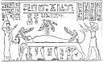
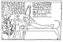
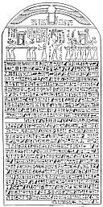

  
[Intangible Textual Heritage](../../index)  [Egypt](../index.md) 
[Index](index)  [Previous](leg07)  [Next](leg09.md) 

------------------------------------------------------------------------

p. xlvii

### V.

### LEGEND OF THE BIRTH OF HORUS, SON OF ISIS AND OSIRIS.

 

 [  
Click to enlarge](img/pl14.jpg.md)  
PLATE XIV.  
The Procreation of Horus, son of Isis.

 

THE text which contains this legend is found cut in hieroglyphics upon a
stele which is now preserved in Paris. Attention was first called to it
by Chabas, who in 1857 gave a translation of it in the *Revue
Archéologique*, p. 65 ff., and pointed out the importance of its
contents with his characteristic ability. The hieroglyphic text was
first published by Ledrain in his work on the monuments of the
Bibliothèque Nationale in Paris, [1](#fn_23.md) and
I gave a transcript of the text, with transliteration and translation,
in 1895. [2](#fn_24.md)

The greater part of the text consists of a hymn to Osiris, which was
probably composed under the XVIIIth Dynasty, when an extraordinary
development of the cult of that god took place, and when he was placed
by Egyptian theologians at the head of all the gods. Though unseen in
the temples, his presence filled all Egypt, and his body formed the very
substance of the country. He was the God of all gods and the Governor of
the Two Companies of the gods, he formed the soul and body of Ra, he was
the beneficent Spirit of all spirits, he was himself the celestial food
on

p. xlviii

which the Doubles in the Other World lived. He was the greatest of the
gods in On (Heliopolis), Memphis, Herakleopolis, Hermopolis, Abydos, and
the region of the First Cataract, and so. He embodied in his own person
the might of Ra-Tem, Apis and Ptah, the Horus-gods, Thoth and Khnemu,
and his rule over Busiris and Abydos continued to be supreme, as it had
been for many, many hundreds of years. He was the source of the Nile,
the north wind sprang from him, his seats were the stars of heaven which
never set, and the imperishable stars were his ministers. All heaven was
his dominion, and the doors of the sky opened before him of their own
accord when he appeared. He inherited the earth from his father Keb, and
the sovereignty of heaven from his mother Nut. In his person he united
endless time in the past and endless time in the future. Like Ra he had
fought Seba, or Set, the monster of evil, and had defeated him, and his
victory assured to him lasting authority over the gods and the dead. He
exercised his creative power in making land and water, trees and herbs,
cattle and other four-footed beasts, birds of all kinds, and fish and
creeping things; even the waste spaces of the desert owed allegiance to
him as the creator. And he rolled out the sky, and set the light above
the darkness.

The last paragraph of the text contains an allusion to Isis, the sister
and wife of Osiris, and mentions the legend of the birth of Horus, which
even under the XVIIIth Dynasty was very ancient, Isis, we are

p. xlix

told, was the constant protectress of her brother, she drove away the
fiends that wanted to attack him, and kept them out of his shrine and
tomb, and she guarded him from all accidents. All these things she did
by means of spells and incantations, large numbers of which were known
to her, and by her power as the "witch-goddess." Her "mouth was trained
to perfection, and she made no mistake in pronouncing her spells, and
her tongue was skilled and halted not." At length came the unlucky day
when Set succeeded in killing Osiris during the war which the "good god"
was waging against him and his fiends. Details of the engagement are
wanting, but the Pyramid Texts state that the body of Osiris was hurled
to the ground by Set at a place called Netat, which seems to have been
near Abydos. [1](#fn_25.md) The news of the death
of Osiris was brought to Isis, and she at once set out to find his body.
All legends agree in saying that she took the form of a bird, and that
she flew about unceasingly, going hither and thither, and uttering
wailing cries of grief. At length she found the body, and with a
piercing cry she alighted on the ground. The Pyramid Texts say that
Nephthys was with her that "Isis came, Nephthys came, the one on the
right side, the other on the left side, one in the form of a
*<u>H</u>at* bird, the other in the form of a *Tchert* bird, and they
found Osiris thrown on the ground in Netat by

p. l

his brother Set." The late form of the legend goes on to say that Isis
fanned the body with her feathers, and produced air, and that at length
she caused the inert members of Osiris to move, and drew from him his
essence, wherefrom she produced her child Horus.

This bare statement of the dogma of the conception of Horus does not
represent all that is known about it, and it may well be supplemented by
a passage from the Pyramid Texts, [1](#fn_26.md)
which reads, "Adoration to thee, O Osiris. [2](#fn_27.md) Rise thou up on thy left side, place
thyself on thy right side. This water which I give unto thee is the
water of youth (or rejuvenation). Adoration to thee, O Osiris! Rise thou
up on thy left side, place thyself on thy right side. This bread which I
have made for thee is warmth. Adoration to thee, O Osiris! The doors of
heaven are opened to thee, the doors of the streams are thrown wide open
to thee. The gods in the city of Pe come \[to thee\], Osiris, at the
sound (or voice) of the supplication of Isis and Nephthys. . . . . . .
Thy elder sister took thy body in her arms, she chafed thy hands, she
clasped thee to her breast \[when\] she found thee \[lying\] on thy side
on the plain of Netat." And in another place we

 

 [  
Click to enlarge](img/pl15.jpg.md)  
PLATE XV.

 [  
Click to enlarge](img/pl16.jpg.md)  
PLATE XVI.  
The Stele recording the casting out of a devil from the Princess of
Bekhten.

p. li

read: [1](#fn_28.md) "Thy two sisters, Isis and
Nephthys, came to thee, Kam-urt, in thy name of Kam-ur, Uatchet-urt, in
thy name of Uatch-ur" . . . . . . . "Isis and Nephthys weave magical
protection for thee in the city of Saut, for thee their lord, in thy
name of 'Lord of Saut,' for their god, in thy name of 'God.' They praise
thee; go not thou far from them in thy name of 'Tua.' They present
offerings to thee; be not wroth in thy name of 'Tchentru.' Thy sister
Isis cometh to thee rejoicing in her love for thee. [2](#fn_29.md) Thou hast union with her, thy seed
entereth her. She conceiveth in the form of the star Septet (Sothis).
Horus-Sept issueth from thee in the form of Horus, dweller in the star
Septet. Thou makest a spirit to be in him in his name 'Spirit dwelling
in the god Tchentru.' He avengeth thee in his name of 'Horus, the son
who avenged his father.' Hail, Osiris, Keb hath brought to thee Horus,
he hath avenged thee, he hath brought to thee the hearts of the gods,
Horus hath given thee his Eye, thou hast taken possession of the Urert
Crown thereby at the head of the gods. Horus hath presented to thee thy
members, he hath collected them completely, there is no disorder in
thee. Thoth hath seized thy enemy and hath slain him and those who were
with him." The above words are addressed to dead kings in the Pyramid

p. lii

\[paragraph continues\] Texts, and what the gods were supposed to do for
them was believed by the Egyptians to have been actually done for
Osiris. These extracts are peculiarly valuable, for they prove that the
legend of Osiris which was current under the XVIIIth Dynasty was based
upon traditions which were universally accepted in Egypt under the Vth
and VIth Dynasties.

The hymn concludes with a reference to the accession of Horus, son of
Isis, the flesh and bone of Osiris, to the throne of his grandfather
Keb, and to the welcome which he received from the Tchatcha, or
Administrators of heaven, and the Company of the Gods, and the Lords of
Truth, who assembled in the Great House of Heliopolis to acknowledge his
sovereignty. His succession also received the approval of Neb-er-tcher,
who, as we saw from the first legend in this book, was the Creator of
the Universe.

------------------------------------------------------------------------

### Footnotes

[xlvii:1](leg08.htm#fr_23.md) *Les Monuments
Égyptiens* (*Cabinet des Médailles et Antiques*), In the *Bibliothèque
de l'École des Hautes Études*, Paris, 1879-1882, plate xxii. ff.

[xlvii:2](leg08.htm#fr_24.md) *First Steps in
Egyptian*, pp. 179-188.

[xlix:1](leg08.htm#fr_25.md) Pepi I., line 475;
Pepi II., line 1263.

[l:1](leg08.htm#fr_26.md) Mer-en-Ra, line 336; Pepi
II., line 862.

[l:2](leg08.htm#fr_27.md) I omit the king's names.

[li:1](leg08.htm#fr_28.md) Teta, line 274; Pepi I.,
line 27; Mer-en-Ra, line 37; and Pepi II., line 67.

[li:2](leg08.htm#fr_29.md) Pyramid Text, Teta, l.
276.

------------------------------------------------------------------------

[Next: Summary: VI. A Legend of Khensu Nefer-hetep and the Princess of
Bekhten](leg09.md)
