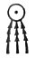

  
[Intangible Textual Heritage](../../index)  [Egypt](../index) 
[Index](index)  [Previous](leg20)  [Next](leg22) 

------------------------------------------------------------------------

p. 56 p. 57

### THE LEGEND OF HORUS OF BEHUTET AND THE WINGED DISK.

XII 2. In the three hundred and sixty-third year of Ra-Heru-Khuti, who
liveth for ever and forever, His Majesty was in TA-KENS, [1](#fn_74) and his soldiers were with him; \[the
enemy\] did not conspire (*auu*) against their lord, and the land \[is
called\] UAUATET unto this day. **3**. And Ra set out on an expedition
in his boat, and his followers were with him, and he arrived at
UTHES-HERU, [2](#fn_75) \[which lay to\] the
west of this nome, and to the east of the canal PAKHENNU, which is
called \[ . . . . . . . . to this day\]. And Heru-Behutet was **4** in
the boat of Ra, and he said unto his father Ra-Heru-Khuti (i.e.,
Ra-Harmachis), I see that the enemies are conspiring against their lord;
let thy fiery serpent gain the mastery . . . . . over them." **XIII.
1**. Then the Majesty of Ra Harmachis said unto thy divine KA, O
Heru-Behutet, O son of Ra, thou exalted one, who didst proceed from me,
overthrow thou the enemies who are before thee straightway." And
Heru-Behutet flew up into the horizon in the form of the great Winged
Disk, for which reason he is called "Great god, lord of

p. 58 p. 59

heaven," unto this day. And when he saw the enemies in the heights of
heaven he set out to follow after them in the form of the great Winged
Disk, and he attacked with such terrific force those who opposed him,
**2** that they could neither see with their eyes nor hear with their
ears, and each of them slew his fellow. In a moment of time there was
not a single creature left alive. Then Heru Behutet, shining with very
many colours, came in the form of the great Winged Disk to the Boat of
Ra-Harmachis, and Thoth said unto Ra, "O Lord of the gods, Behutet hath
returned in the form of the great Winged Disk, shining \[with many
colours\] . . . . . . children;" **3** for this reason he is called
Heru-Behutet unto this day. And Thoth said, "The city Teb shall be
called the city of Heru-Behutet," and thus is it called unto this day.
And Ra embraced the . . . . . of Ra, and said unto Heru-Behutet, "Thou
didst put grapes [1](#fn_76) into the water
which cometh forth from it, [2](#fn_77) and thy
heart rejoiced thereat;" and for this reason the water (or, canal) of
Heru-Behutet is called "\[Grape-Water\]" unto this day, and the . . . .
. . . . . . . unto this day. **4**. And Heru-Behutet said, "Advance, O
Ra, and look thou upon thine enemies who are lying under thee on this
land;" thereupon the Majesty of Ra set out on the way, and the goddess
ASTHERTET ('Ashtoreth?) was with him, and he saw the enemies overthrown
on the ground, each one of them being fettered. Then said Ra to
Heru-Behutet, **5** "There is sweet

p. 60 p. 61

life in this place," and for this reason the abode of the palace of
Heru-Behutet is called "Sweet Life" unto this day. And Ra, said unto
Thoth, "\[Here was the slaughter\] of mine enemies; "and the place is
called TEB [1](#fn_78) unto this day. And Thoth
said unto Heru-Behutet, "Thou art a great protector (*makaa*);" and
**6** the Boat of Heru-Behutet is called MAKAA [2](#fn_79) unto this day. Then said Ra unto the gods
who were in his following, "Behold now, let us sail in our boat upon the
water, for our hearts are glad because our enemies have been overthrown
on the earth;" and the water where the great god sailed is **7** called
P-KHEN-UR [3](#fn_80) unto this day. And behold
the enemies \[of Ra\] rushed into the water, and they took the forms of
\[crocodiles and\] hippopotami, but nevertheless Ra-Heru-Khuti sailed
over the waters in his boat, and when the crocodiles and the hippopotami
had come nigh unto him, they opened wide their jaws in order to destroy
Ra-Heru-Khuti. **8**. And when Heru-Behutet arrived and his followers
who were behind him in the forms of workers in metal, each having in his
hands an iron spear and a chain, according to his name, they smote the
crocodiles and the hippopotami; and there were brought in there
straightway six hundred and fifty-one crocodiles, **9** which had been
slain before the city of Edfu. Then spake Ra-Harmachis unto
Heru-Behutet, "My Image shall be \[here\] in the land of the South,
(which is a house of victory (or, strength); "and the House of
Heru-Behutet is called NEKHT-HET unto this

p. 62 p. 63

day. **XIV. 1**. Then the god Thoth spake, after he had looked upon the
enemies lying upon the ground, saying, "Let your hearts rejoice, O ye
gods of heaven! Let your hearts rejoice, O ye gods who are in the earth!
Horus, the Youthful One, cometh in peace, and he hath made manifest on
his journey deeds of very great might, which he hath performed according
to "the Book of Slaying the Hippopotamus." And from that day figures of
Heru-Behutet in metal have existed.

Then Heru-Behutet took upon himself the form of the Winged Disk, and he
placed himself upon the front of the Boat of Ea. **2**. And he placed by
his side the goddess Nekhebet [1](#fn_81) and
the goddess Uatchet, [2](#fn_82) in the form of
two serpents, that they might make the enemies to quake in \[all\] their
limbs when they were in the forms of crocodiles and hippopotami in every
place wherein be came in the Land of the South and in the Land of the
North. Then those enemies rose up to make their escape from before him,
and their face was towards the Land of the South. And their hearts were
stricken down through fear of him. And Heru-Behutet was at the back (or,
side) of them in the Boat of Ra, and there were in his hands a metal
lance and a metal chain; and the metal workers who were with their lord
were equipped **3** for fighting with lances and chains. And
Heru-Behutet saw them [3](#fn_83) to the
south-east of the city of Uast (Thebes) some distance away. Then Ra said
to Thoth, "Those enemies shall be smitten with blows that kill;" and
Thoth

p. 64 p. 65

said to Ra, "\[That place\] is called the city TCHET-MET unto this day."
And Heru-Behutet made a great overthrow among them, and Ra said, "Stand
still, O Heru-Behutet," and \[that place\] is called "HET-RA" to this
day, and the god who dwelleth therein is Heru-Behutet-Ra-Amsu (or, Min).
**4**. Then those enemies rose up to make their escape from before him,
and the face of the god was towards the Land of the North, and their
hearts were stricken through fear of him. And Heru-Behutet was at the
back (or, side) of them in the Boat of Ra, and those who were following
him had spears of metal and chains of metal in their hands; **5** and
the god himself was equipped for battle with the weapons of the metal
workers which they had with them. And he passed a whole day before he
saw them to the north-east of the nome of TENTYRA (Dendera). Then Ra
said unto Thoth, "The enemies are resting . . . . . . . their lord."
**6**. And the Majesty of Ra-Harmachis said to Heru-Behutet, "Thou art
my exalted son who didst proceed from Nut. The courage of the (enemies
hath failed in a moment." And Heru-Behutet made great slaughter among
them. And Thoth said "The Winged Disk shall be called. . . . . in the
name of this Aat;" **7** and is called Heru-Behutet . . . . . its
mistress. His name is to the South in the name of this god, and the
acacia and the sycamore shall be the trees of the sanctuary.

p. 66 p. 67

\[paragraph continues\] Then the enemies turned aside to flee from
before him, and their faces were \[towards the North, and they went\] to
**8** the swamps of Uatch-ur (i.e., the Mediterranean), and \[their
courage failed through fear of him\]. And Heru-Behutet was at the back
(or, side) of them in the Boat of Ra, and the metal spear was in his
hands, and those who were in his following were equipped with the
weapons for battle of the metal workers. **9**. And the god spent four
days and four nights in the water in pursuit of them, but he did not see
one of the enemies, who fled from before him in the water in the forms
of crocodiles and hippopotami. At length he found them and saw them. And
Ra said unto Horus of Heben, "O Winged Disk, thou great god and lord of
heaven, **10** seize thou them . . . . . .;" and he hurled his lance
after them, and he slew them, and worked a great overthrow of them. And
he brought one hundred and forty-two enemies to the forepart of the Boat
\[of Ra\], and with them was a male hippopotamus **11** which had been
among those enemies. And he hacked them in pieces with his knife, and he
gave their entrails to those who were in his following, and he gave
their carcases to the gods and goddesses who were in the Boat of Ra on
the river-bank of the city of Heben. Then Ra said unto Thoth, **12**
"See what mighty things Heru-Behutet hath performed in his deeds against
the enemies: verily he hath smitten them! And of the male hippopotamus
he hath opened the mouth, and he

p. 68 p. 69

hath speared it, and he hath mounted upon its back." Then said Thoth to
Ra," Horus shall be called 'Winged Disk, Great God, **13** Smiter of the
enemies in the town of Heben' from this day forward, and he shall be
called 'He who standeth on the back' and 'prophet of this god,' from
this day forward." These are the things which happened in the lands of
the city of Heben, in a region which measured three hundred and
forty-two measures on the south, and on the north, on the west, and on
the east.

XV\. 1. Then the enemies rose up before him by the Lake of the North,
and their faces were set towards Uatch-ur [1](#fn_84) which they desired to reach by sailing;
but the god smote their hearts and they turned and fled in the water,
and they directed their course to the water of the nome of Mertet-Ament,
and they gathered themselves together in the water of Mertet in order to
join themselves with the enemies \[who serve\] Set and who are in this
region. And Heru-Behutet followed them, being equipped with all his
weapons of war to fight against them. **2**. And Heru-Behutet made a
journey in the Boat of Ra, together with the great god who was in his
boat with those who were his followers, and he pursued them on the Lake
of the North twice, and passed one day and one night sailing down the
river in pursuit of them before he perceived and overtook them, for he
knew not the place where they were. Then he arrived at the city of
Per-Rehu. And the

p. 70 p. 71

Majesty of Ra said unto Heru-Behutet, "What hath happened to the
enemies? They have gathered together themselves in the water to the west
(?) of the nome of Mertet in order to unite themselves with the enemies
\[who serve\] Set, and who are in this region, **3** at the place where
are our staff and sceptre." And Thoth said unto Ra, "Uast in the nome of
Mertet is called Uaseb because of this unto this day, and the Lake which
is in it is called TEMPT." Then Heru-Behutet spake in the presence of
his father Ra, saying, "I beseech thee to set thy boat against them, so
that I may be able to perform against them that which Ra willeth;" and
this was done. Then he made an attack upon them on the Lake which was at
the west of this district, and he perceived them on the bank of the city
. . . . . . which belongeth to the Lake of Mertet. **4**. Then
Heru-Behutet made an expedition against them, and his followers were
with him, and they were provided with weapons of all kinds for battle,
and he wrought a great overthrow among them, and he brought in three
hundred and eighty-one enemies, and he slaughtered them in the forepart
of the Boat of Ra, **5** and he gave one of them to each of those who
were in his train. Then Set rose up and came forth, and raged loudly
with words of cursing and abuse because of the things which Heru-behutet
had done in respect of the slaughter of the enemies. And Ra said unto
Thoth, "This fiend Nehaha-hra uttereth words at the top of his voice
because of

p. 72 p. 73

the things which **6** Heru-Behutet hath done unto him;" and Thoth said
unto Ra, "Cries of this kind shall be called Nehaha-hra unto this day."
And Heru-Behutet did battle with the Enemy for a period of time, and he
hurled his iron lance at him, and he throw him down on the ground in
this region, **7** which is called Pa-Rerehtu unto this day. Then
Heru-Behutet came and brought the Enemy with him, and his spear was in
his neck, and his chain was round his hands and arms, and the weapon of
Horus had fallen on his mouth and had closed it; and he went with him
before his father Ra, who said, "O Horus, thou Winged Disk, **8** twice
great (Urui-Tenten) is the deed of valour which thou hast done, and thou
hast cleansed the district." And Ra, said unto Thoth, "The palace of
Heru-Behutet shall be called, 'Lord of the district which is cleansed'
because of this;" and \[thus is it called\] unto this day. And the name
of the priest thereof is called Ur-Tenten unto this day. **9**. And Ra
said unto Thoth, "Let the enemies and Set be given over to Isis and her
son Horus, and let them work all their heart's desire upon them." And
she and her son Horus set themselves in position with their spears in
him at the time when there was storm (or, disaster) in the district, and
the Lake of the god was **10** called SHE-EN-AHA from that day to this.
Then Horus the son of Isis cut off the head of the Enemy \[Set\], and
the heads of his fiends in the presence of father Ra and of

p. 74 p. 75

the great company of the gods, and he dragged him by his feet through
his district with his spear driven through his head and back. And Ra
said unto Thoth, **11** "Let the son of Osiris drag the being of
disaster through his territory;" and Thoth said, "It shall be called
ATEH," and this hath been the name of the region from that day to this.
And Isis, the divine lady, spake before Ra, saying, "Let the exalted
Winged Disk become the amulet of my son Horus, who hath cut off the head
of the Enemy and the heads of his fiends."

XVI\. 1. Thus Heru-Behutet and Horus, the son of Isis, slaughtered that
evil Enemy, and his fiends, and the inert foes, and came forth with them
to the water on the west side of this district. And Heru-Behutet was in
the form of a man of mighty strength, and he had the face of a hawk, and
his head was crowned with the White Crown and the Red Crown, and with
two plumes and two uraei, and he had the back of a hawk, and his spear
and his chain were in his hands. And Horus, the son of Isis, transformed
himself into a similar shape, even as Heru-Behutet had done before him.
**2**. And they slew the enemies all together on the west of Per-Rehu,
on the edge of the stream, and this god hath sailed over the water
wherein the enemies had banded themselves to-ether against him from that
day to this. Now these things took place on the 7th day of the first
mouth of the season PERT. And Thoth said, "This region shall be called
AAT-SHATET," and this hath been the name of the region from that day

p. 76 p. 77

unto this; and the Lake which is close by it **3** hath been called TEMT
from that day to this, and the 7th day of the first month of the season
PERT hath been called the FESTIVAL OF SAILING from that day to this.

Then Set took upon himself the form of a hissing serpent, and he entered
into the earth in this district without being seen. And Ra said, "Set
hath taken upon himself the form of a hissing serpent. Let Horus, the
son of Isis, in the form of a hawk-headed staff, set himself over the
place where he is, so that the serpent may never more appear." **4**.
And Thoth said, "Let this district be called HEMHEMET [1](#fn_85) by name;" and thus hath it been called
from that day to this. And Horus, the son of Isis, in the form of a
hawk-headed staff, took up his abode there with his mother Isis; in this
manner did these things happen.

Then the Boat of Ra arrived at the town of Het-Aha; **5** its forepart
was made of palm wood, and the hind part was made of acacia wood; thus
the palm tree and the acacia tree have been sacred trees from that day
to this. Then Heru-Behutet embarked in the Boat of Ra, after he had made
an end of fighting, and sailed; and Ra said unto Thoth, "Let this Boat
be called . . . . . . .;" and thus hath it been called from that day to
this, **6** and these things have been done in commemoration in this
place from that day to this.

And Ra said unto Heru-Behutet, "Behold the fighting of the Smait fiend
and his two-fold strength, and the Smai fiend Set, are upon the water of
the

p. 78 p. 79

\[paragraph continues\] North, and they will sail down stream upon . . .
. . ." \[And\] Heru-Behutet said, "Whatsoever thou commandest shall take
place, **7** O Ra, Lord of the gods. Grant thou, however, that this thy
Boat may pursue them into every place whithersoever they shall go, and I
will do to them whatsoever pleaseth Ra." And everything was done
according to what he had said. Then this Boat of Ra was brought by the
winged Sun-disk upon the waters of the Lake of Meh, [1](#fn_86) \[and\] Heru-Behutet took in his hands his
weapons, his darts, and his harpoon, and all the chains \[which he
required\] for the fight.

8\. And Heru-Behutet looked and saw one \[only\] of these Sebau [2](#fn_87) fiends there on the spot, and he was by
himself. And he threw one metal dart, and brought (or, dragged) them
along straightway, and he slaughtered them in the presence of Ra. And he
made an end \[of them, and there were no more of the fiends\] of Set in
this place at \[that\] moment.

XVII 1. And Thoth said, "This place shall be called AST-AB-HERU," [3](#fn_88) because Heru-Behutet wrought his desire
upon them (i.e., the enemy); and he passed six days and six nights
coming into port on the waters thereof and did not see one of them. And
he saw them fall down in the watery depths, and he made ready the place
of Ast-ab-Heru there. It was situated on the bank of the water, and the
face (i.e., direction) thereof was full-front towards the South. **2**.
And all the rites and ceremonies of Heru-Behutet were performed on the
first day of the first month [4](#fn_89) of the

p. 80 p. 81

season Akhet, and on the first day of the first month [1](#fn_90) of the season Pert, and on the
twenty-first and twenty-fourth days of the second month [2](#fn_91) of the season Pert. These are the
festivals in the town of Ast-ab, by the side of the South, in
An-rut-f. [3](#fn_92) And he came into port and
went against them, keeping watch as for a king over the Great God in
An-rut-f, in this place, in order to drive away the Enemy and his Smaiu
fiends at his coming by night from the region of Mertet, to the west of
this place. **3**.

And Heru-Behutet was in the form of a man who possessed great strength,
with the face of a hawk; and he was crowned with the White Crown, [4](#fn_93) and the Red Crown, [5](#fn_94) and the two plumes, and the Urerit Crown,
and there were two uraei upon his head. His hand grasped firmly his
harpoon to slay the hippopotamus, which was \[as hard\] as the
*khenem* [6](#fn_95) stone in its mountain bed.

And Ra said unto Thoth, "Indeed \[Heru-\]Behutet is like a
Master-fighter in the slaughter of his enemies . . . . . ."

And Thoth said unto Ra, "He shall be called 'Neb-Ahau'" (i.e.,
Master-fighter); and for this reason he hath been thus called by the
priest of this god unto this day.

4\. And Isis made incantations of every kind in order to drive away the
fiend Ra from An-rut-f, and from the Great God in this place. And Thoth
said \[unto Ra\], 'The priestess of this god shall be called by the name
of 'Nebt-Heka' for this reason."

p. 82 p. 83

And Thoth said unto Ra, "Beautiful, beautiful is this place wherein thou
hast taken up thy seat, keeping watch, as for a king, over the Great God
who is in An-rut-f [1](#fn_96) in peace."

5\. And Thoth said, "This Great House in this place shall. therefore be
called 'Ast-Nefert' [2](#fn_97) from this day.
"It is situated to the south-west of the city of Nart, and \[covereth\]
a space of four schoinoi." And Ra Heru-Behutet said unto Thoth, "Hast
thou not searched through this water for the enemy?" And Thoth said,
**6** "The water of the God-house in this place shall be called by the
name of 'Heh' (i.e., sought out)." And Ra said, "Thy ship, O
Heru-Behutet, is great (?) upon Ant-mer (?) . . . . . . And Thoth said,
"The name of \[thy ship\] shall be called 'Ur', and this stream shall be
called 'Ant-mer (?).'" **7**. As concerning (or, now) the place Ab-Bat
(?) is situated on the shore of the water. "Ast-nefert" is the name of
the Great house, "Neb-Aha" \[is the name of\] the priest . . . . . . . .
is the name of the priestess, "Heh" is the name of the lake . . . . . .
. \[is the name\] of the water, **8** "Am-her-net" is the name of the
holy (?) acacia tree, "Neter het" is the name of the domain of the god,
"Uru" is the name of the sacred boat, the gods therein are Heru-Behutet,
the smiter of the lands, Horus, the son of Isis \[and\] Osiris . . . . .
. . . **9** his blacksmiths [3](#fn_98) are to
him, and those who are in his following are to him in his territory,
with his metal lance, with his \[mace\], with

p. 84 p. 85

his dagger, and with all his chains (or, fetters) which are in the city
of Heru-Behutet.

\[And when he had reached the land of the North with his followers, he
found the enemy.\] **10**. Now as for the blacksmiths who were over the
middle regions, they made a great slaughter of the enemy, and there were
brought back one hundred and six of them. Now as for the blacksmiths of
the West, they brought back one hundred and six of the enemy. Now as for
the blacksmiths of the East, among whom was Heru-Behutet, **11** he slew
them (i.e., the enemy) in the presence of Ra. in the Middle
Domains. [1](#fn_99)

And Ra, said unto Thoth, "My heart \[is satisfied\] with the works of
these blacksmiths of Heru-Behutet who are in his bodyguard. They shall
dwell in sanctuaries, and libations and purifications and (offerings
shall be made to their images, and **12** \[there shall be appointed for
them\] priests who shall minister by the month, and priests who shall
minister by the hour, in all their God-houses whatsoever, as their
reward because they have slain the enemies of the god."

And Thoth said, "The \[Middle\] Domains shall be called after the names
of these blacksmiths from this day onwards, **13** and the god who
dwelleth among them, Heru-Behutet, shall be called the 'Lord of Mesent'
from this day onwards, and the domain shall be called 'Mesent of the
West' from this day onwards."

As concerning Mesent of the West, the face (or, front) thereof shall be
towards \[the East\], towards the place

p. 86 p. 87

where Ra riseth, and this Mesent shall be called "Mesent of the East"
from this day onwards. **14**. As concerning the double town of Mesent,
the work of these blacksmiths of the East, the face (or, front) thereof
shall be towards the South, towards the city of Behutet, the
hiding-place of Heru-Behutet. And there shall be performed therein all
the rites and ceremonies of Heru-Behutet on the second day of the first
month [1](#fn_100) of the season of Akhet, and
on the twenty-fourth day of the fourth month [2](#fn_101) of the season of Akhet, and on the
seventh day of the first month [3](#fn_102) of
the season Pert, and on the twenty-first day of the second month [4](#fn_103) of the season Pert, from this day
onwards. **15**. Their stream shall be called "Asti," the name of their
Great House shall be called "Abet," the \[priest (?)\] shall be called
"Qen-aha," and their domain shall be called "Kau-Mesent" from this day
onwards.

XVIII\. 1. And Ra said unto Heru-Behutet, "These enemies have sailed up
the river, to the country of Setet, to the end of the pillar-house of
<u>H</u>at, and they have sailed up the river to the east, to the
country or Tchalt (or, Tchart), [5](#fn_104)
which is their region of swamps." And Heru-Behutet said, "Everything
which thou hast commanded hath come to pass, Ra, Lord of the (gods; thou
art the lord of commands." And they untied the Boat of Ra, and they
sailed up the river to the east. Then he looked upon those enemies
whereof some of them had fallen into the sea (or, river), and the others
had fallen headlong on the mountains. **2**.

And Heru-Behutet transformed himself into a lion

p. 88 p. 89

which had the face of a man, and which was crowned with the triple
crown. [1](#fn_105) His paw was like unto a
flint knife, and he went round and round by the side of them, and
brought back one hundred and forty-two \[of the enemy\], and be rent
them in pieces with his claws. He tore out their tongues, and their
blood flowed on the ridges of the land in this place; and he made them
the property of those who were in his following \[whilst\] he was upon
the mountains.

And Ra said unto Thoth, "Behold, Heru-Behutet is like unto a lion in his
lair \[when\] he is on the back of the enemy who have given unto him
their tongues."

3\. And Thoth said, "This domain shall be called 'Khent-abt,' and it
shall \[also\] be called 'Tchalt' (or, Tchart) from this day onwards.
And the bringing of the tongues from the remote places of Tchalt (or,
Tchart) \[shall be commemorated\] from this day onwards. And this god
shall be called 'Heru-Behutet, Lord of Mesent,' from this day onwards."

And Ra said unto Heru-Behutet, "Let us sail to the south up the river,
and let us smite the enemies \[who are\] in the forms of crocodiles and
hippopotami in the face of Egypt."

4\. And Heru-Behutet said, "Thy divine KA, O Ra, Lord of the gods! Let
us sail up the river against the remainder--one third--of the enemies
who are in the water (or, river)." Then Thoth recited the Chapters of
protecting the Boat \[of Ra\] and the boats of the blacksmiths, **5**
\[which he used\] for making tranquil the sea at the moment when a storm
was raging on it.

p. 90 p. 91

And Ra said unto Thoth, "Have we not journeyed throughout the whole
land? Shall we not journey cover the whole sea in like manner?" And
Thoth said, "This water shall be called the 'Sea of journeying,' from
this day onward."

And they sailed about over the water during the night, **6** and they
did not see any of those enemies at all.

Then they made a journey forth and arrived in the country of
Ta-sti, [1](#fn_106) at the town of
Shas-hertet, and he perceived the most able of their enemies in the
country of Uaua, [2](#fn_107) and they were
uttering treason against Horus their Lord.

7 And Heru-Behut changed his form into that of the Winged Disk, \[and
took his place\] above the bow of the Boat of Ra. And he made the
goddess Nekhebit [3](#fn_108) and the goddess
Uatchit [4](#fn_109) to be with him in the form
of serpents, so that they might make the Sebau fiends to quake in
\[all\] their limbs (or, bodies). Their boldness (i.e., that of the
fiends) subsided through the fear of him, they made no resistance
whatsoever, and they died straightway.

8 Then the gods who were in the following of the Boat of Heru-khuti
said, "Great, great is that which he hath done among them by means of
the two Serpent Goddesses, [5](#fn_110) for he
hath overthrown the enemy by means of their fear of him."

And Ra Heru-khuti said, "The great one of the two Serpent Goddesses of
Heru-Behutet shall be called 'Ur-Uatchti' [6](#fn_111) from this day onwards."

p. 92 p. 93

XIX\. 1. And Heru-khuti travelled on in his boat, and landed at the city
of Thes-Heru (Apollinopolis Magna). And Thoth said, "The being of light
who hath come forth from the horizon hath smitten the enemy in the form
which he hath made, and he shall be called Being of light who hath come
forth from the horizon from this day onwards." [1](#fn_112)

And Ra Heru-khuti (Ra Harmachis) said to Thoth, Thou shalt make this
Winged Disk to be in every place wherein I seat myself (or, dwell), and
in \[all\] the seats of the gods in the South, and in \[all\] the seats
of the gods in the Land of the North . . . . . . . in the Country of
Horus, **2** that it may drive away the evil ones from their domains."

Then Thoth made the image of the Winged Disk to be in every sanctuary
and in every temple, where they now are, wherein are all the gods and
all the goddesses from this day onwards. Now through the Winged Disk
which is on the temple-buildings of all the gods and all the goddesses
of the Land of the Lily, [2](#fn_113) and the
Land of the Papyrus, [3](#fn_114) \[these
buildings\] become shrines of Heru-Behutet.

As concerning Heru-Behutet, the great god, the lord of heaven, the
president of the Ater of the South, [4](#fn_115) he it is who is made to be on the right
hand. This is Heru-Behutet **3** on whom the goddess Nekhebit is placed
in the form of a serpent (or, uraeus). As concerning Heru-Behutet, the
great god, the lord of heaven, the lord of Mesent, the president of the
Ater of the North, [5](#fn_116)

p. 94 p. 95

he it is who is made to be on the left hand. This Heru-Behutet on whom
the goddess Uatchit is placed is in the form of a serpent.

As concerning Heru-Behutet, the great god, the lord of heaven, the lord
of Mesent, the president of the two Aterti of the South and North, Ra
Heru-khuti set it (i.e., the Winged Disk) in his every place, to
overthrow the enemies in every place wherein they are. And he shall be
called President of the two Aterti of the South and North because of
this from this day onwards. [1](#fn_117)

------------------------------------------------------------------------

### Footnotes

[57:1](leg21.htm#fr_75) I.e., in Nubia, probably
the portion of it which lies round about the modern Kalabsha. In ancient
days Ta-kens appears to have included a portion of the Nile Valley to
the north of Aswan.

[57:2](leg21.htm#fr_76) I.e., Apollinopolis, the
modern Edfu.

[59:1](leg21.htm#fr_77) I.e. drops of blood.

[59:2](leg21.htm#fr_78) I.e., from the city.

[61:1](leg21.htm#fr_79) I.e., Edfu.

[61:2](leg21.htm#fr_80) I.e., Great Protector.

[61:3](leg21.htm#fr_81) I.e., "Great Canal."

[63:1](leg21.htm#fr_82) The goddess Nekhebet was
incarnate in a special kind of serpent, and the centre of her worship
was in the city of Nekheb, which the Greeks called Eileithyiaspolis, and
the Arabs Al-Kab.

[63:2](leg21.htm#fr_83) The centre of the
worship of Uatchet, or Uatchit, was at Per-Uatchet, a city in the Delta.

[63:3](leg21.htm#fr_84) I.e., the enemies.

[69:1](leg21.htm#fr_85) I.e., the Mediterranean.

[77:1](leg21.htm#fr_86) This name means "the
place of the Roarer," HEMHEMTI, being a well-known name of the Evil One.
Some texts seem to indicate that peals of thunder were caused by the
fiend Set.

[79:1](leg21.htm#fr_87) It is probable that the
Lake of Meh, i.e., the Lake of the North, was situated in the north-east
of the Delta, not far from Lake Manzalah.

[79:2](leg21.htm#fr_88) "Sebiu" is a common name
for the associates of Seti, and this fiend is himself called "Seba," a
word which means something like "rebel."

[79:3](leg21.htm#fr_89) I.e., place of the
desire of Horus.

[79:4](leg21.htm#fr_90) The month Thoth.

[81:1](leg21.htm#fr_91) The month Tybi.

[81:2](leg21.htm#fr_92) The month Mekhir.

[81:3](leg21.htm#fr_93) A mythological locality
originally placed near Herakleopolis. The name means "the place where
nothing grows." Several forms of the name occur in the older literature,
e.g. in the Theban  
Recension of the Book of the Dead.

[81:4](leg21.htm#fr_94) The Crown of the South.

[81:5](leg21.htm#fr_95) The Crown of the North.

[81:6](leg21.htm#fr_96) A kind of jasper (?).

[83:1](leg21.htm#fr_97) I.e., Osiris.

[83:2](leg21.htm#fr_98) I.e., "Beautiful Place."

[83:3](leg21.htm#fr_99) Or perhaps fighting men
who were armed with metal weapons.

[85:1](leg21.htm#fr_100) In the sculptures
(Naville, *Mythe*, pl. 17) Heru-Behutet is seen standing in a boat
spearing a crocodile, and immediately behind d him in the boat is
Ra-Harmachis in his shrine. The Mesentiu of the West are represented by
an armed warrior in a boat, who is spearing a crocodile, and leads the
way for Heru-Behutet. In a boat behind the great god is a representative
of the Mesentiu of the East spearing a crocodile.

[87:1](leg21.htm#fr_101) The month Thoth.

[87:2](leg21.htm#fr_102) The month Choiak.

[87:3](leg21.htm#fr_103) The month Tybi.

[87:4](leg21.htm#fr_104) The mouth Mechir.

[87:5](leg21.htm#fr_105) Zoan-Tanis.

[89:1](leg21.htm#fr_106) In the sculpture
(Naville, *Mythe*, pl. 18), we see a representation of this lion, which
is standing over the bodies of slain enemies upon a rectangular
pedestal, or block.

[91:1](leg21.htm#fr_107) Northern Nubia; the
name means "Land of the Bow."

[91:2](leg21.htm#fr_108) A portion of Northern
Nubia.

[91:3](leg21.htm#fr_109) The goddess of the
South.

[91:4](leg21.htm#fr_110) The goddess of the
North.

[91:5](leg21.htm#fr_111) I.e., Nekhebit and
Uatchit.

[91:6](leg21.htm#fr_112) "Great one of the Two
Uraei-goddesses;" these goddesses had their places above the brow of the
god, or at the right and left of the solar disk.

[93:1](leg21.htm#fr_113) In the sculpture
(Naville, *Mythe*, pl. 19) we see the god, who is hawk-headed, and wears
the crowns of the South and North, seated in a shrine set upon a
pedestal. In the right hand he holds the sceptre and in the left the
*ankh*.

[93:2](leg21.htm#fr_114) I.e., the North,
especially the Delta.

[93:3](leg21.htm#fr_115) I.e., the South.

[93:4](leg21.htm#fr_116) I.e., the southern
half of heaven.

[93:5](leg21.htm#fr_117) I.e., the northern
half of heaven.

[95:1](leg21.htm#fr_118) In the sculpture which
illustrates this portion of the text at Edfu, two Winged Disks are
represented. The first has 
 on each side of it. The disk has an uraeus on each
side. The second winged symbol of the god consists of a beetle with
outstretched wings, which holds between his forelegs the solar disk, and
between his hind legs the symbol of the orbit of the sun.

------------------------------------------------------------------------

[Next: A Hymn To Osiris And A Legend Of The Origin Of Horus.](leg22)
