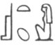

  
[Intangible Textual Heritage](../../index)  [Egypt](../index.md) 
[Index](index)  [Previous](leg29)  [Next](leg31.md) 

------------------------------------------------------------------------

II\. To desire, therefore, and covet after truth, those truths more
especially which concern the divine nature, is to aspire to be partakers
of that nature itself, and to profess that all our studies and inquiries
are devoted to the acquisition of holiness. This occupation is surely
more truly religious than any external purifications or mere service of
the temple can be. But more especially must such a disposition of mind
be highly acceptable to that goddess to whose service you are dedicated,
for her especial characteristics are wisdom and foresight, and her very
name seems to express the peculiar relation which she bears to
knowledge. For "Isis" [1](#fn_259.md) is a Greek
word, and means "knowledge," and

p. 200

\[paragraph continues\] "Typhon," [1](leg31.htm#fn_260.md) the name of her professed
adversary, is also a Greek word, and means "pride and insolence." This
latter name is well adapted to one who, full of ignorance and error,
tears in pieces and conceals that holy doctrine which the goddess
collects, compiles, and delivers to those who aspire after the most
perfect participation in the divine nature. This doctrine inculcates a
steady perseverance in one uniform and temperate course of life, and an
abstinence from particular kinds of foods, as well as from all
indulgence of the carnal appetite, and it restrains the intemperate and
voluptuous part within due bounds, and at the same time habituates her
votaries to undergo those austere and rigid ceremonies which their
religion obliges them to observe. The end and aim of all these toils and
labours is the attainment of the knowledge of the First and Chief Being,
who alone is the object of the understanding of the mind; and this
knowledge the goddess invites us to seek after, as being near and
dwelling continually with her. And this also is what the very name of
her temple promiseth to us, that is to say, the knowledge and
understanding of the eternal and self-existent Being (τοῦ ὄντας)-now, it
is called "Iseion," which suggests that if we approach the temple of the
goddess rightly, and with purity, we shall obtain the knowledge of that
eternal and self-existent Being (τὸ ὂν).

------------------------------------------------------------------------

### Footnotes

[199:1](leg30.htm#fr_261.md) The Egyptian form of
the name is AS-T,  ,  , or  . Plutarch wishes to derive the
name from some form of οῖ᾽δα.

------------------------------------------------------------------------

[Next: Section III](leg31.md)
