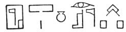

  
[Intangible Textual Heritage](../../index)  [Egypt](../index.md) 
[Index](index)  [Previous](leg48)  [Next](leg50.md) 

------------------------------------------------------------------------

XXI\. Eudoxus indeed asserts that, although there

p. 232

are many pretended sepulchres of Osiris in Egypt, the, place where his
body actually lies is Busiris, [1](leg50.htm#fn_320.md) where likewise he was
born. [2](leg50.htm#fn_321.md) As to Taphosiris,
there is no need to mention it particularly, for its very name indicates
its claim to be the tomb of Osiris. There are likewise other
circumstances in the Egyptian ritual which hint to us the reality upon
which this history is grounded, such as their cleaving the trunk of a
tree, their wrapping it up in linen which they tear in pieces for that
purpose, and the libations of oil which they afterwards pour upon it;
but these I do not insist on, because they are intermixed with such of
their mysteries as may not be revealed.

------------------------------------------------------------------------

### Footnotes

[231:1](leg48.htm#fr_319.md) Apis is called the
"life of Osiris,"  , and
on the death of the Bull, its soul went to heaven and joined itself to
that of Osiris, and it formed with him the dual-god Asar-Hep, i.e.,
Osiris-Apis, or Sarapis. The famous Serapeum at Memphis was called  .

[231:2](leg48.htm#fr_320.md) In Egyptian,
MEN-NEFER, i.e., "fair haven."

[231:3](leg48.htm#fr_321.md) Osiris and Isis were
worshipped at Philae until the reign of Justinian, when his general,
Narses, closed the temple and carried off the statues of the gods to
Constantinople, where they were probably melted down.

------------------------------------------------------------------------

[Next: Section XXII. First Explanation of the Story](leg50.md)
