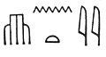
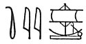
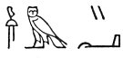
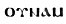

  
[Intangible Textual Heritage](../../index)  [Egypt](../index.md) 
[Index](index)  [Previous](leg57)  [Next](leg59.md) 

------------------------------------------------------------------------

\[THIRD EXPLANATION OF THE STORY.\]

XXXII\. Such then are the arguments of those who endeavour to account
for the above-mentioned history of Isis and Osiris upon a supposition
that they were

p. 239

of the order of Daemons; but there are others who pretend to explain it
upon other principles, and in more philosophical manner. To begin, then,
with those whose reasoning is the most simple and obvious. As the Greeks
allegorize their Kronos into Time, and their Hera into Air, and tell us
that the birth of Hephaistos is no other but the change of air into
fire, so these philosophers say that by Osiris the Egyptians mean the
Nile, by Isis that part of the country which Osiris, or the Nile,
overflows, and by Typhon the sea, which, by receiving the Nile as it
runs into it, does, as it were, tear it into many pieces, and indeed
entirely destroys it, excepting only so much of it as is admitted into
the bosom of the earth in its passage over it, which is thereby rendered
fertile. The truth of this explanation is confirmed, they say, by that
sacred dirge which they make over Osiris when they bewail "him who was
born on the right side of the world and who perished on the left." [1](#fn_324.md) For it must be observed that the
Egyptians look upon the east as the front or face of the world, [2](#fn_325.md) upon the north as its right side, [3](#fn_326.md) and upon

p. 240

the south as its left. [1](#fn_327.md) As,
therefore, the Nile rises in the south, and running directly northwards
is at last swallowed up by the sea, it may rightly enough be said to be
born on the right and to perish on the left side, This conclusion, they
say, is still farther strengthened from that abhorrence which the
priests express towards the sea, as well as salt, which they call
"Typhon's foam." And amongst their prohibitions is one which forbids
salt being laid on their tables. And do they not also carefully avoid
speaking to pilots, because this class of men have much to do with the
sea and get their living by it? And this is not the least of their
reasons for the great dislike which they have for fish, and they even
make the fish a symbol of "hatred," as is proved by the pictures which
are to be seen on the porch of the temple of Neith at Saïs. The first of
these is a child, the second is an old man, the third is a hawk, and
then follow a fish and a hippopotamus. The meaning of all these is
evidently, "O you who are coming into the world, and you who are going
out of it (i.e., both young and old), God hateth impudence." For by the
child is indicated "all those who are coming into life"; by the old man,
"those who are going out of it"; by the hawk, "God"; by the fish,
"hatred," on account of the sea, as has been before stated; and by the
hippopotamus, "impudence," this creature being said first to slay his
sire, and afterwards to force his

p. 241

dam. [1](leg59.htm#fn_328.md) The Pythagoreans
likewise may be thought perhaps by some to have looked upon the sea as
impure, and quite different from all the rest of nature, and that thus
much is intended by them when they call it the "tears of Kronos."

------------------------------------------------------------------------

### Footnotes

[239:1](leg58.htm#fr_326.md) Plutarch here refers
to Osiris as the Moon, which rises in the West.

[239:2](leg58.htm#fr_327.md) According to the
texts the front of the world was the south, *khent*,   and from this word is formed
the verb    "to sail to the south."

[239:3](leg58.htm#fr_328.md) In the texts the west
is the right side, *unemi*, 
 in Coptic, 
.

[240:1](leg58.htm#fr_329.md) In the texts the east
is the left side, *abti*.

------------------------------------------------------------------------

[Next: Sections XXXIII and XXXIV](leg59.md)
