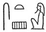
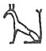
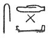

  
[Intangible Textual Heritage](../../index)  [Egypt](../index.md) 
[Index](index)  [Previous](leg63)  [Next](leg65.md) 

------------------------------------------------------------------------

\[FOURTH EXPLANATION OF THE STORY.\]

\[§ XLI. Osiris is the Moon, and Typhon is the Sun; Typhon is therefore
called Seth, [1](#fn_341.md) a word meaning
"violence," "force," &c. Herakles accompanies the Sun, and Hermes the
Moon. In § XLII. Plutarch connects the death-day of Osiris, the
seventeenth of Hathor, with the seventeenth day of the Moon's
revolution, when she begins to wane. The age of Osiris, twenty-eight
years, suggests the comparison with the twenty-eight days of the Moon's
revolution. The tree-trunk which is made into the shape of a crescent at
the funeral of Osiris refers to the crescent moon when she

p. 246

wanes. The fourteen pieces into which Osiris was broken refer to the
fourteen days in which the moon wanes.\]

------------------------------------------------------------------------

### Footnotes

[245:1](leg64.htm#fr_343.md) In Egyptian, , or   which Plutarch seems to
connect with *set*,  .

------------------------------------------------------------------------

[Next: Section XLIII](leg65.md)
