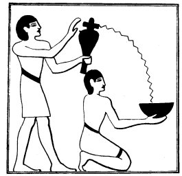
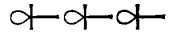

  
[Intangible Textual Heritage](../../index)  [Egypt](../index.md) 
[Index](index)  [Previous](lfo005)  [Next](lfo007.md) 

------------------------------------------------------------------------

p. 42

### THE FIRST CEREMONY.

To cleanse and purify the statue so that it might become a suitable and
permanent dwelling-place for the KA was the object of the first
ceremony. The SEM priest took up a vessel filled with clean water,

   
The Sem priest pouring water from a libation vase into a libation bowl
held by a ministrant.

in which salt or soda had been dissolved, and poured it into a bowl
which was held in the hands of an assistant. He next walked round the
statue four times, sprinkling the salted water on it on all sides, or
perhaps washing portions of it, and meanwhile the Kher heb said four
times:--

p. 43

"O Osiris, everything which is hateful in Unas hath been carried away
for thee; for that which was uttered in his name of evil hath Thoth
come, and he hath carried it away to Osiris. I have brought that which
was spoken in the name of Unas of evil, and have placed it in the palm
of thy hand. The SA shall not be separated from thee, and thou shalt not
be separated from it."

From the way in which Osiris is mentioned in this passage it is clear
that the cult of this god was general in Egypt when this Liturgy was
drawn up, and that be was already recognized as the god of the dead. The
effect of the sprinkling of water over the statue, or the washing of it
with water, was to remove the sins of the deceased from him, and to
cleanse his body and Ka. There can be no doubt that the Egyptians in all
periods attached very great importance to the use of water ceremonially,
and there is good reason for believing that they regarded it as one of
the principal sources of life since the gods were created from water,
and Nu, the great god of the celestial deeps, was the father of the
gods. They believed that water possessed a mysterious power which made
itself manifest under the form of life, and it may be noted in passing
that, in the scenes in which Thoth and Horus are pouring out water over
the heads of kings, the water is indicated by series of ankh signs  , i.e., "life, life, life."
Dümichen has already in this connection pointed out the fact that in the
"Tale of the Two Brothers," Anpu put the heart of

p. 44

his younger brother Bata into a vessel of water; when the heart had
absorbed all the water it came to life. Water not only washed away sin,
but gave new birth and life to the dead.

The Gnostics, who preserved many ancient Egyptian beliefs, attached
great importance to the use of water ceremonially, and, according to
Irenaeus (*Haeres*, 1, 2, § 5), they threw oil and water over the heads
of the dying to make them invisible to the powers of darkness. The
ancient Egyptians certainly dissolved salt, or soda in some form, in
their "holy water," and it is probable that they pronounced some formula
over it before sprinkling it upon the dead. The sprinkling of the dead
was the first and most important of burial ceremonies among the
Egyptians for thousands of years, and it is probable that it was
adopted, under the name of baptism of the dead, by many sections of the
Christian Church. For centuries certain Christians actually baptized the
dead, and they continued to do so in spite of the prohibitions of many
Councils.

The exact meaning which is to be attached to the word *tu* or "evil" is
not quite clear; [1](#fn_49.md) it was certainly
connected with the words of Unas, but whatever it was this "evil" was
carried to Osiris by Thoth. Here we see Thoth acting as a sort of
advocate for Unas with Osiris, and playing his part as the "lord of
divine words," and author of holy books, with which we are familiar from
the texts of the Theban Recension of the

p. 45

\[paragraph continues\] *Book of the Dead*. In the Judgment it was he
who "weighed words," and who weighed the heart of the dead man in the
Great Balance, and reported the result to Osiris. It is the "words" of
Unas which are in question here, and in Egypt both gods and men judged a
man by his "words." The sprinkling of the water caused Thoth to carry
the words of evil uttered by Unas, and place them in the hand of the
god.

The words which were said by the Kher heb here, as in many other places
in the Liturgy, were to be repeated four times. The Egyptians divided
the earth into four quarters, over each of which a god presided, and in
order to secure for the dead permission to move about freely through
these quarters of the world, formulae, whether of blessing or of
banning, were repeated four times, once for each god, and certain
offerings were made in quadruplicate. The gods of the four quarters of
the world at the time when this Liturgy was drawn up were Horus, Set,
Thoth, and Sep, and they were probably the gods of the four cardinal
points also. Later, however, their places seem to have been taken by the
four sons of Horus, Mestha, Hapi, Tuamutef and Qebhsennuf, each of whom
presided over one of the four pillars that held up the sky. The priest
by walking round the mummy or the statue four times, and sprinkling
water as he went, bestowed upon the Ka the power to journey into all
parts of heaven and earth, and made him a pure being in respect of the
four gods of the four quarters of the earth.

p. 46

At the end of the first formula quoted above come the words, "The *Sa*
shall not be separated from thee, and thou shalt not be separated from
it." By the word *Sa*, the Egyptians understood that mysterious energy
and life-giving power which existed in the gods, and which for want of a
better name we may call the "fluid of life." Its source was the Sun-god,
by whatever name he is called, Horus or Ra, and Ra, in the text of
Unas [1](#fn_50.md) is said to be "Sovereign of the
divine *Sa*". The gods and goddesses received this *Sa* from Ra and
communicated it to those whom they loved upon earth. According to M.
Moret. [2](#fn_51.md) the fluid of life could be
transmitted from the being who possessed it to the person to whom it was
desired to transfer it, by embracing that person and by making "magnetic
passes" along the back. M. Maspero also describes the Sa as a sort of
"magnetic fluid," or "aura," which could be transmitted to a person by
laying hands on him, or by making passes over the nape of the neck or
the spinal column. The phrase *setep sa* means something like to "make
passes." The *Sa* was transmitted to a king from the statue of a god by
placing the arms of the statue round him, and by laying one of its hands
on the nape of his neck as he knelt before it. [3](#fn_52.md)

p. 47

\[paragraph continues\] When the statue had exhausted the store of the
power which was in it, it was able to obtain a fresh supply from the
Other World. The object of making passes before the statue of the dead,
or his mummy, was to give a place in the fore-front of the company of
the KHU, or "Spirits," in the Other World. This is certain from a
passage in the text of Pepi I., wherein it is said, "The passes by which
he obtaineth the fluid of life having been made over him by \[Ra\] and
Horus, he is at the head of the KHU" (l. 695).

------------------------------------------------------------------------

### Footnotes

[44:1](lfo006.htm#fr_49.md) Maspero renders it by
*Mauvais*.

[46:1](lfo006.htm#fr_50.md) Line 562, *Suzerain de
la vertu divine*. Maspero.

[46:2](lfo006.htm#fr_51.md) *Le Rituel du Culte
divin journalier*, Paris, 1902, p. 99.

[46:3](lfo006.htm#fr_52.md) *Contes Populaires*, p.
165.

------------------------------------------------------------------------

[Next: The Second Ceremony](lfo007.md)
