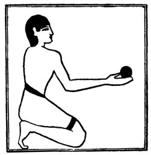

  
[Intangible Textual Heritage](../../index)  [Egypt](../index.md) 
[Index](index)  [Previous](lfo010)  [Next](lfo012.md) 

------------------------------------------------------------------------

p. 62

### THE SIXTH CEREMONY.

In the next ceremony the SEM priest continues the purification of the
deceased, and on this occasion he takes in his hand a ball of incense
and lifts it up before the face of the mummy, or statue. We may assume
that he does this four, or even five, times, and offers four balls of
incense, one for Horus, one for Set, one for

 

   
The Sem priest presenting a ball of incense.

 

\[paragraph continues\] Thoth, and one for Sep. Meanwhile the Kher heb
says:--

"Thou art purified with natron, and Horus is purified with natron.

"Thou art purified with natron, and Set is purified with natron.

"Thou art purified with natron, and Thoth is purified with natron.

"Thou art purified with natron, and Sep is purified with natron.

p. 63

"Thou art purified with natron, and thy KA is purified with natron.

"Thou art purified with natron,

"Thou art purified with natron,

"Thou art purified with natron,

"Thou art purified with natron,

"O thou who art stablished among thy brethren the gods.

"Thy head hath been censed for thee, thy bones have been cleansed
thoroughly for thee, and thou art filled with that which belongeth unto
thee. O Osiris, I have given unto thee the Eye of Horus, and thy face is
filled therewith, and it spreadeth its odour about thee."

------------------------------------------------------------------------

[Next: The Seventh Ceremony](lfo012.md)
