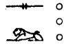
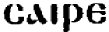

  
[Intangible Textual Heritage](../../index)  [Egypt](../index.md) 
[Index](index)  [Previous](lfo013)  [Next](lfo015.md) 

------------------------------------------------------------------------

### THE NINTH CEREMONY.

The first object presented to the mummy after the opening of the mouth
was *sel*, or *ser*,  
which has been translated both by "butter" and "cheese." The Vignette
represents the SEM priest offering a vessel with four balls, or round
cakes, of some substance in it,

 

   
The Sem priest presenting cheese.

 

and, when we remember that the Egyptians have never made butter in our
sense of the word, we are justified in accepting Dümichen's rendering of
"cheese." [1](#fn_55.md) Whilst the four cakes of
cheese were being offered, the Kher heb said the following words:--

"O Unas, the Eye of Horus hath been presented

p. 68

unto thee, and with it the god passeth (or, cometh); I have brought it
unto thee: place thou it in thy mouth."

------------------------------------------------------------------------

### Footnotes

[67:1](lfo014.htm#fr_55.md) The Egyptian   is probably the original of
the Coptic  ; compare
Genesis xviii. 8 (ed. Ciasca, p. 18).

------------------------------------------------------------------------

[Next: The Tenth Ceremony](lfo015.md)
