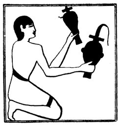

  
[Intangible Textual Heritage](../../index)  [Egypt](../index.md) 
[Index](index)  [Previous](lfo015)  [Next](lfo017.md) 

------------------------------------------------------------------------

p. 69

### THE ELEVENTH CEREMONY.

In the next ceremony the SEM priest offered a vessel of milk and a
vessel of whey (?), and whilst he did so the Kher heb said:--

"\[That which is\] from the breast of thy sister Isis, the emission of
thy mother, thou hast taken possession of for thy mouth."

 

   
The Sem priest presenting a vessel of milk and a vessel of whey (?).

 

The text of Peta-Amen-apt is somewhat fuller, and reads:--

"\[That which floweth\] from the breast of Horus, and is of his body,
hath been presented unto thee for thy mouth. That which cometh from the
breast of thy sister Isis, the emission of thy mother, hath been seized
by thee for thy mouth, and thou openest thy mouth by means of it."

------------------------------------------------------------------------

[Next: The Twelfth Ceremony](lfo017.md)
