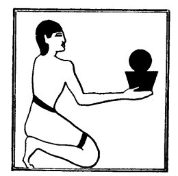

  
[Intangible Textual Heritage](../../index)  [Egypt](../index) 
[Index](index)  [Previous](lfo018)  [Next](lfo020) 

------------------------------------------------------------------------

### THE FOURTEENTH CEREMONY.

In the next ceremony the SEM priest offered a bread-cake, of the kind
called Hem, which was presented for the "lifting up of the face" of the
deceased. This name is followed by the word *tchaut*, the exact meaning
of which is not easy to say. In the "Hem"-cake Dümichen [1](#fn_56) thought he saw the original of a cake in
use among the Egyptians which was stamped with a figure of a vanquished
hippopotamus; this beast was the symbol of Set, or Typhon, as we know
from the texts, and from Plutarch, [2](#fn_57)
who says that he was chained. In the pictures of the chained
hippopotamus [3](#fn_58) the head of the monster
is

p. 73

turned back," i.e., he is looking behind him, and it is possible that
the name "Hem," which means "to turn back," was given to cakes because
they were stamped with a figure of the animal in this attitude. The
words pat tchaut Maspero renders by "Gâteau de passage," and Dümichen by
"Hem-Brod wohlschmeckendes (?) the former rendering gives the better
sense. The "Gâteau de passage" is the equivalent of the round bread-cake
which is common all over Egypt and the

 

   
The Sem priest presenting the Hem cake.

 

Sudan at the present day, and it is the first thing with which the
native provides himself when he is about to set out on a journey. Whilst
the SEM offers the *hem* cake the Kher heb says:--

"Day hath made an offering unto thee in the sky.

"The South and the North have caused an offering to be made unto thee.

"Night hath made an offering unto thee.

p. 74

"The South and the North have made an offering unto thee.

"An offering is brought unto thee. An offering thou seest, of an
offering thou hearest.

"There is an offering before thee, an offering behind thee, an offering
with thee."

------------------------------------------------------------------------

### Footnotes

[72:1](lfo019.htm#fr_56) *Grabpalast*, i., p.
23.

[72:2](lfo019.htm#fr_57) *De Iside*, Cap. 50.

[72:3](lfo019.htm#fr_58) Naville, *Mythe
d'Horus*, pll. 3 fl.

------------------------------------------------------------------------

[Next: The Fifteenth Ceremony](lfo020)
