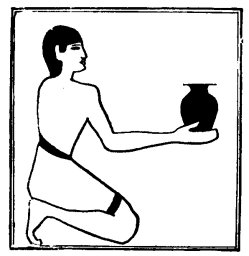
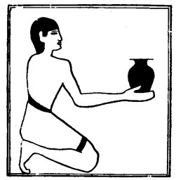

  
[Intangible Textual Heritage](../../index)  [Egypt](../index) 
[Index](index)  [Previous](lfo021)  [Next](lfo023) 

------------------------------------------------------------------------

### THE SEVENTEENTH AND EIGHTEENTH CEREMONIES.

In the next two ceremonies the SEM priest offers two vessels of wine to
the deceased, each containing a Hathes measure; one vessel is made of
some white

p. 77

material, and the other of black. Whilst the former is being offered the
Kher heb says:--

"Osiris Unas, the Eye of Horus hath been presented unto thee; it hath
been snatched from the hand of Set, and thou hast taken possession of it
for thy mouth, and thou hast opened thy mouth therewith."

And whilst the latter is being offered he says:--

"Osiris Unas, thy mouth is opened by that which

   
The Sem priest presenting a white vessel of wine.

floweth(?) from thee." The words "Eye of Horus which hath been snatched
from the hand of Set" refer to the belief that it was Set, the god of
darkness, who swallowed the sun and moon during eclipses, and devoured
the moon piecemeal after it was fourteen days old. The Eye of Horus was
restored to him sometimes by Shu, who snatched it out of the hand of
Set, [1](#fn_59) but more

p. 78

frequently by Thoth, who is often represented in the form of an
ibis-headed man carrying the Eye of Horus 
 before him in his hands. As the Eye of Horus was the
abode of disembodied souls and spirits, the presentation of this eye to
the mummy, or statue, was equivalent to restoring to it the soul of the
deceased. In this passage, and throughout the Liturgy generally,

 

   
The Sem priest presenting a white vessel of wine.

 

the fundamental idea of the presentation of objects which are symbolic
of the Eye of Horus is to bring back to the deceased his KA and BA,
i.e., soul and the various members of his spiritual and mental economy.

The wine in the black vessel is declared to be the fluids or humours
which ran out of the deceased before death, or during the process of
preparing him for the tomb. They are here restored to him in the form of
wine, the nature of which is changed by the words of the Kher heb.

------------------------------------------------------------------------

### Footnotes

[77:1](lfo022.htm#fr_59) Lefébure, *Le Mythe
Osirien*, p. 87; Moret, *Rituel*, p. 84.

------------------------------------------------------------------------

[Next: The Nineteenth Ceremony](lfo023)
