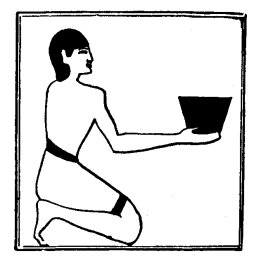

  
[Intangible Textual Heritage](../../index)  [Egypt](../index.md) 
[Index](index)  [Previous](lfo022)  [Next](lfo024.md) 

------------------------------------------------------------------------

p. 79

### THE NINETEENTH CEREMONY.

The process of restoring to the deceased the fluid of his body is
continued in the next ceremony, wherein the SEM priest presents to him a
black stone vase, containing *hent* beer. Whilst he is doing this the
Kher heb says:--

"Osiris Unas, there hath been presented unto thee

 

   
The Sem priest presenting a black stone vessel of Hent beer.

 

that which hath been pressed out of thee, which hath come forth from
thee."

------------------------------------------------------------------------

[Next: The Twentieth Ceremony](lfo024.md)
