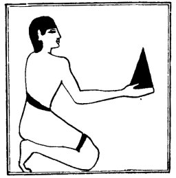

  
[Intangible Textual Heritage](../../index)  [Egypt](../index.md) 
[Index](index)  [Previous](lfo024)  [Next](lfo026.md) 

------------------------------------------------------------------------

p. 81

### THE TWENTY-FIRST CEREMONY.

In the next ceremonies the various kinds of bread and cakes on the
"Tchesert" table were offered one by one. The first was the *tept*, and
as the SEM priest presented it the Kher heb said:--

"Unas, the Eye of Horus hath been presented unto thee for thy tasting."

   
The Sem priest presenting the Tept cake.

Here there is a play on the words *tept*, a "kind of bread," and *tep*,
"to taste."

------------------------------------------------------------------------

[Next: The Twenty-second Ceremony](lfo026.md)
