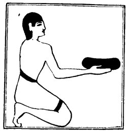

  
[Intangible Textual Heritage](../../index)  [Egypt](../index.md) 
[Index](index)  [Previous](lfo025)  [Next](lfo027.md) 

------------------------------------------------------------------------

### THE TWENTY-SECOND CEREMONY.

The next offering was the *ah* which according to Dümichen was not a
bread-cake, but a lump of cooked meal, like the *Puls* of the Romans and
the *Polenta* of the modern Italians. According to Maspero, it was a
flat cake mixed with fat, and perhaps sweetened, and folded like a
pancake. Whilst the SEM

p. 82

priest presents this the Kher heb pronounces a formula, which in the
Unas text seems to mean,

"The darkness (or, the night) becometh denser and denser," and in the
text of Peta-Amen-apt,

"The *ah* food is spread out before thee like a field."

It is clear that in the one text there is a play of words in *ahah* and
*akka*, and in the other in *ahah* and *ah*, but the exact meanings of
the sentences are unknown because we do not understand the allusions.

 

   
The Sem priest presenting the *Ah* meal.

 

\[paragraph continues\] Dümichen thought that the word *akka*, i.e.,
"darkness or night," referred to the colour of the *ah*-cake, and that
it might have been baked to a brown colour which was so dark in
comparison with the *tept* cake that it appeared to be black.

------------------------------------------------------------------------

[Next: The Twenty-third Ceremony](lfo027.md)
