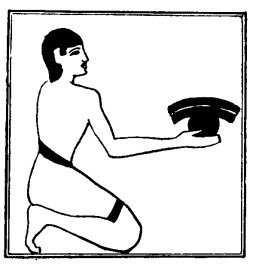

  
[Intangible Textual Heritage](../../index)  [Egypt](../index.md) 
[Index](index)  [Previous](lfo026)  [Next](lfo028.md) 

------------------------------------------------------------------------

### THE TWENTY-THIRD CEREMONY.

In this ceremony the SEM priest offered the breast of some animal, and
as he did so the Kher heb said:--

p. 83

"Unas, the Eye of Horus hath been presented unto thee so that it may
embrace thee (or, be united unto thee)."

The breast naturally symbolized the act of embracing, which was in
itself an important ceremony. When Horus embraced the deceased, the act
of embracing him "smote Set," and when he had snatched his Eye out of
the hand of the god of evil, "he gave to the deceased his heart, and the
power which was therein." [1](#fn_60.md)

 

   
The Sem priest presenting the breast.

 

When, in the Tale of the Two Brothers, Anpu restored to Batau his heart,
each embraced the other. [2](#fn_61.md) Life

p. 84

was given to a statue by embracing it, and when a living person, priest,
or relative embraced a mummy, his, or her, object was to reunite the
bones, to knit together afresh the flesh, and to give order to the
members of the body, which in primitive times had been dislocated, like
the body of Osiris, and then put together, piece by piece, to form a
complete whole. [1](#fn_62.md) As to the breast
itself, we may note in passing that in the Levitical law it was ordered
that the breast of a ram should be waved for a wave offering before the
Lord (Leviticus vii. 30).

------------------------------------------------------------------------

### Footnotes

[83:1](lfo027.htm#fr_60.md) See Teta, l. 173., and
Moret's excellent remarks in *Rituel*, p. 88.

[83:2](lfo027.htm#fr_61.md) Papyrus D'Orbiney, pl.
xiv., ll. 3, 4.

[84:1](lfo027.htm#fr_62.md) Moret, *Rituel*, p. 89.

------------------------------------------------------------------------

[Next: The Twenty-fourth Ceremony](lfo028.md)
