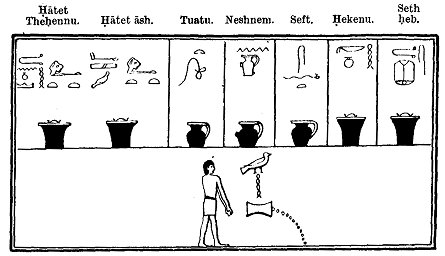

  
[Intangible Textual Heritage](../../index)  [Egypt](../index.md) 
[Index](index)  [Previous](lfo031)  [Next](lfo033.md) 

------------------------------------------------------------------------

### THE TWENTY-EIGHTH TO THIRTY-FOURTH CEREMONIES.

These seven ceremonies deal with the anointing of the mummy, or statue,
with seven kinds of unguents, which are called:--

1\. Seth heb,

2\. Hekenu,

3\. Sefth,

4\. Neshnem,

5\. Tuatu,

6\. Hatet ash,

7\. Hatet Thehennu,

p. 89

The SEM priest offered a vessel of the Seth heb unguent, and the Kher
heb said four times:--

"Osiris Unas, I have filled thine eye for thee with *metchet* oil."

He, next offered a vessel of Hekenu. Unguent, and the Kher heb said:--

"Osiris Unas, there hath been presented unto thee

 

THE SEVEN UNGUENTS.  
   
The Sem priest pouring out libations.

 

that which hath been pressed out from thy face."

He next offered a vessel of Seft unguent, and the Kher heb said:--

"Osiris Unas, the Eye of Horus hath been presented unto thee, and
\[Set\] hath been made weak in respect of thee thereby."

The Seft unguent was dark in colour, and symbolized Set, the god of
darkness, and as it represented the

p. 90

greasy emanation of his face this god was supposed to suffer through its
absence.

The SEM priest next offered a vessel of Neshnem unguent, and the Kher
heb said:--

"Osiris Unas, the Eye of Horus hath been presented unto thee, that it
may unite itself unto thee."

He next offered a vessel of Tuatu. unguent, and the Kher heb said:--

"Osiris Unas, the Eye of Horus hath been presented unto thee, that the
gods may be brought unto thee thereby."

In the text of Peta-Amen-apt the reading is:--

"\[Osiris\] Peta-Amen-apt, the Eye of Horus hath been presented unto
thee. It hath been brought \[unto thee\] that thou mayest worship (or,
give thanks to) the gods by means of it."

The SEM priest then offered a vessel of the finest cedar oil, Hatet ash,
and a vessel of the finest oil of the Thehennu (Hatet Thehennu), and the
Kher heb said:--

"O ye Oils, O ye Oils, which are on the forehead of Horus \[place ye
yourselves on the forehead of the Osiris Unas, make ye him to smell
sweet in possessing you\], make ye him to become a KHU (i.e., Spirit)
through possessing you, make ye him to have his SEKHEM (i.e., Vital
Power) in his body, make ye him to have openings before his eyes, and
let all the KHU (i.e., Spirits) see him, and let them all hear his name.
Behold, Osiris Unas, the Eye of Horus hath been

p. 91

brought unto thee, for it hath been seized that it may be before thee."

------------------------------------------------------------------------

[Next: The Thirty-fifth Ceremony](lfo033.md)
