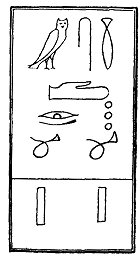

  
[Intangible Textual Heritage](../../index)  [Egypt](../index.md) 
[Index](index)  [Previous](lfo032)  [Next](lfo034.md) 

------------------------------------------------------------------------

### THE THIRTY-FIFTH CEREMONY.

In this ceremony the materials with which the eyes of the deceased are
to be painted are offered. The SEM priest took a bag of Uatch and a bag
of Mestemet, and as he offered them the Kher heb said:--

   
A bag of Uatch and a bag of Mestemet.

"Osiris Unas, I have painted for thee the Eye of Horus with Mestemet so
that there may be health to thy face."

The eye-paint called Uatch was first used as a medicine for the eyes,
and only later as an ornament; it was a preparation of copper. The
eye-lids were first smeared with oil or some unguent, and the powder was

p. 92

applied to them by means of a short, thin stick made of wood, bone, or
metal, which among the Arabs is called a "needle." The eye-paint
Mestemet, which appears in Coptic under the form  , or  , was made from antimony, and
its use was general; it was used daily, and was believed to protect the
eye against ophthalmia. In modern times preparations of lead, black
oxide of manganese, the lamp-black of burnt almonds, &c., are commonly
used as "Kohl," or eye-paint.

------------------------------------------------------------------------

[Next: The Thirty-sixth Ceremony](lfo034.md)
