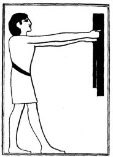
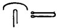
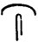
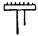

  
[Intangible Textual Heritage](../../index)  [Egypt](../index) 
[Index](index)  [Previous](lfo033)  [Next](lfo035) 

------------------------------------------------------------------------

### THE THIRTY-SIXTH CEREMONY.

In the next ceremony the SEM priest offered two linen bandlets, or
scarves, or sashes, called *unkhu* to the deceased, and as he did so the
Kher heb said-

"Watch thou in peace. The goddess TAAT watcheth in peace, the goddess
TAAT watcheth in peace. The Eye of Horus which is in the city of Pe-Tep
watcheth in peace. The Eye of Horus which is in the temple houses of Net
watcheth in peace. Receive thou the milk-\[white\] and bleached bandlets
of the goddess Ur-a. Cause ye, O bandlets, that the Two Lands may submit
to this Unas, even as they bow down before Horus, and make ye the Two
Lands to be in awe of Unas, even as they are terrified before Set. Tarry
ye before Unas in his divinity. Open ye his way at the head of the KHU
(or, Spirits), and let him stand at the head of the Spirits. O
Anpu-Khenti Amenti, forwards, forwards, to the Osiris Unas."

p. 93

The two bandlets are assumed to have been made by the goddess Taat, who
presided over the apparel of the deceased, and provided them with
raiment made by her own hands; as she wove the bandlets she wove into
them her magical protection, which not only preserved their wearers from
the discomforts of nakedness, but assured to them the respect of the
gods and spirits who

 

   
The Sem priest presenting two bandlets.

 

saw them. One bandlet also carried with it the protection of the
Horus-god who dwelt in the city of Pe-Tep, or Buto, and the other the
protection of the Horus-god who dwelt in the city of Net (Neith). Horus
of re-Tep was the son of Isis-Uatchit, and Horus of Sais was the son of
Net, the goddess to whom

p. 94

the invention of the art of weaving was attributed. The city of Sais was
famous in all ages for the production of textile fabrics, and here was
situated "Hetmenkh," the "Temple of woven stuffs." [1](#fn_67) The opening lines of this passage in the
Liturgy are differently translated by Dümichen and Maspero. In his
translation of the text of Unas Maspero rendered the signs   by "Vêts-toi," "clothe
thyself," but later he came to the conclusion that   is not the equivalent of  , and that it is to be read
*res*, i.e., "Watch," or "Keep vigil." Thus his renderings are:--

|                                                                                                                                                                                                                                                                        |                                                                                                                                                                                                                                                                                                                                                        |
|------------------------------------------------------------------------------------------------------------------------------------------------------------------------------------------------------------------------------------------------------------------------|--------------------------------------------------------------------------------------------------------------------------------------------------------------------------------------------------------------------------------------------------------------------------------------------------------------------------------------------------------|
| Vêts-toi en paix! Vêts ton vêtement en paix! Que Taït se vête--*Vêtements de fête, deux*--en paix! Œil d'Hor dans Doup, en paix! Œil d'Horus dans les demeures de Nit, en paix! Reçois le linge blanc! Donne qu'elles se courbent pour cet Ounas, les deux terres, &c. | Veille en paix! veille Tait en paix, veille Taitit en paix! Œil d'Hor qui est dans Dopou en paix, veille Œil d'Hor qui est dans les *Châteaux de Nit* en paix! La plus brillante(?) des nourrices(?), celle qui orne le maitre du tombeau (?), donne que les deux terres se courbent devant ce Pepi Nofirkerî, &c. [2](#fn_68) |

 

The rendering of Dümichen agrees with the older rendering of Maspero as
far as "Nit, en paix!" but

p. 95

for the following words he has "Nimin in Empfang die milchfarbige und
die gebleichte von der Göttin Ur-a. Bewirket, dass sich in Ehrfurcht
beugen die Länder," &c. [1](#fn_69)

At this stage in the service an interval appears to have been allowed to
the deceased to absorb the meat and drink offerings which had been
presented to him, and to take possession of the bandlets, &c. In the
temples the presentation of offerings to the god was nearly always
accompanied by a burning of incense, [2](#fn_70)
for the gods rejoiced in the mingled odours of the objects offered and
the burning incense.

------------------------------------------------------------------------

### Footnotes

[94:1](lfo034.htm#fr_67) De Rougé, *Geographie*,
p. 26.

[94:2](lfo034.htm#fr_68) *Pyramides de
Saqqarah*, p. 362.

[95:1](lfo034.htm#fr_69) *Grabpalast*, i. 28.

[95:2](lfo034.htm#fr_70) Moret, *Rituel*, p.
119.

------------------------------------------------------------------------

[Next: The Thirty-seventh Ceremony](lfo035)
