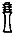
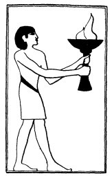

  
[Intangible Textual Heritage](../../index)  [Egypt](../index.md) 
[Index](index)  [Previous](lfo034)  [Next](lfo036.md) 

------------------------------------------------------------------------

### THE THIRTY-SEVENTH CEREMONY.

The SEM priest next burned incense, and as he was doing this the Kher
heb said four times:--

"Let him advance! Let him advance with his KA! Horus advanceth with his
KA, Set advanceth with his KA, Thoth advanceth with his KA, Sep
advanceth with his KA, Osiris advanceth with his KA, Khenti-Maati
advanceth with his KA, thy backbone, 
 advanceth with thy KA.

"Hail, Unas! The arm of thy KA is before thee.

"Hail, Unas! The arm of thy KA is behind thee.

"Hail, Unas! The leg of thy KA is before thee.

"Hail, Unas! The leg of thy KA is behind thee.

p. 96

"Osiris Unas, I have given unto thee the Eye of Horus, and thy face is
filled therewith, and the perfume of the Eye of Horus spreadeth itself
over thee."

 

   
The Sem priest presenting burning incense.

 

------------------------------------------------------------------------

[Next: The Thirty-eighth Ceremony](lfo036.md)
