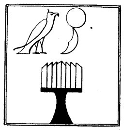

  
[Intangible Textual Heritage](../../index)  [Egypt](../index.md) 
[Index](index)  [Previous](lfo037)  [Next](lfo039.md) 

------------------------------------------------------------------------

### THE THIRTY-NINTH CEREMONY.

The second series of ceremonies began with the bringing in of the *pert
kheru*, or offerings of meat and drink, which were to be placed upon the
altar, and a

 

   
The altar on which the offerings are placed.

 

ministrant came with the *suten hetep*, or "royal offering." Whilst this
was being done the Kher heb said:--

"Thoth returneth bringing it with him, he appeareth with the Eye of
Horus."

"He hath given the Eye of Horus, and he is content therewith."

It has already been said that the Eyes of Horus, or the sun and moon,
suffered eclipse at times through the

p. 101

agency of Set, and that the moon after the fourteenth day was devoured
by him piecemeal each mouth. The souls of the dead who lived in the Eyes
of Horus shared these calamities with the god, and thus it fell out that
when the time had come to make the soul of the deceased to enter his
body, the soul would be found to have disappeared with the solar or
lunar Eye. Sometimes Horus went to look for his Eyes, and sometimes he
sent one of them to look for the other; in every case the Eye was
"found" and restored to the god. Occasionally Shu "found" the Eye in the
hand of Set, and having rescued it from him he gave it back to Horus.

The god, however, to whom Horus was most often indebted for his Eye was
Thoth, who presided over the stars, and knew the times of their
appearances and disappearances, and regulated their courses. Thoth was
called the "Heart of Ra," that is to say, he took possession of the soul
of the god, and it was he who gave back the soul to the deceased, or to
a god. [1](#fn_71.md) In the present case the
mummy, or statue, of the deceased is ready to receive back his soul, and
the Kher heb announces, as we have seen above, that Thoth hath returned
with the Eye of Horus, which he had sought for, and that he hath given
it to the deceased, who is content therewith. The deceased

p. 102

having once more regained his soul, is now able to enjoy the funeral
feast.

------------------------------------------------------------------------

### Footnotes

[101:1](lfo038.htm#fr_71.md) See Dümichen,
*Grabpalast*, p. 29; Moret, *Rituel*, p. 84.

------------------------------------------------------------------------

[Next: The Fortieth Ceremony](lfo039.md)
