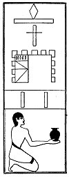

  
[Intangible Textual Heritage](../../index)  [Egypt](../index.md) 
[Index](index)  [Previous](lfo039)  [Next](lfo041.md) 

------------------------------------------------------------------------

p. 103

### THE FORTY-FIRST CEREMONY.

The offering of two vessels of beer in the *usekh* hall [1](#fn_72.md) followed, and the Kher heb said:--

   
The Sem priest presenting two vessels of beer.

"Osiris Unas, the Eye of Horus hath been presented unto thee, and he is
content therewith."

------------------------------------------------------------------------

### Footnotes

[103:1](lfo040.htm#fr_72.md) Dümichen,
*Grabpalast*, p. 30.

------------------------------------------------------------------------

[Next: The Forty-second Ceremony](lfo041.md)
