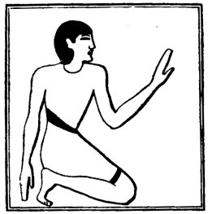

  
[Intangible Textual Heritage](../../index)  [Egypt](../index) 
[Index](index)  [Previous](lfo040)  [Next](lfo042) 

------------------------------------------------------------------------

p. 104

### THE FORTY-SECOND CEREMONY.

The next line of the Liturgy is difficult to translate, for there are
variants in the text. In the Vignette in the tomb of Peta-Amen-apt we
see a man kneeling, with his left hand raised; it is clear that he is
not making an offering, but it is probable that he is "seated" near

 

   
A ministrant kneeling by the side of the offering.

 

the offerings, with the view of partaking of them. The meaning of the
text seems to be something like:--

"He who sitteth down by the *suten pert kheru* (or royal offering) shall
say: I have seated myself with it."

------------------------------------------------------------------------

[Next: The Forty-third Ceremony](lfo042)
