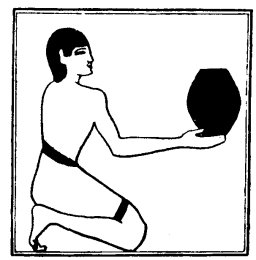

  
[Intangible Textual Heritage](../../index)  [Egypt](../index) 
[Index](index)  [Previous](lfo042)  [Next](lfo044) 

------------------------------------------------------------------------

### THE FORTY-FOURTH CEREMONY.

A Tut cake was next presented, and the Kher heb said:--

 

   
The Sem priest presenting the Tut cake.

 

"Osiris Unas, the Eye of Horus hath been presented unto thee for the
smiting down of Set." [1](#fn_73)

------------------------------------------------------------------------

### Footnotes

[105:1](lfo043.htm#fr_73) The Unas text seems to
be corrupt in this place.

------------------------------------------------------------------------

[Next: The Forty-fifth Ceremony](lfo044)
