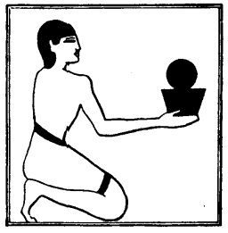

  
[Intangible Textual Heritage](../../index)  [Egypt](../index.md) 
[Index](index)  [Previous](lfo043)  [Next](lfo045.md) 

------------------------------------------------------------------------

p. 106

### THE FORTY-FIFTH CEREMONY.

A Rethu cake was next offered, and the Kher heb said:--

"Osiris Unas, the Eye of Horus, which was chained up \[by Set\], hath
been presented unto thee."

The Rethu cake was round, and on it was probably

 

   
The Sem priest presenting the Rethu cake.

 

stamped a figure of a hippopotamus, symbol of Set, in fetters.

------------------------------------------------------------------------

[Next: The Forty-sixth Ceremony](lfo045.md)
