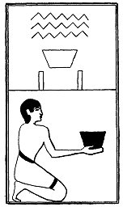

  
[Intangible Textual Heritage](../../index)  [Egypt](../index.md) 
[Index](index)  [Previous](lfo049)  [Next](lfo051.md) 

------------------------------------------------------------------------

p. 111

### THE FIFTY-FIRST CEREMONY.

Two vases of water, with the formula:--

"Osiris Unas, the water which is in these hath been offered unto thee."

 

   
The Sem priest presenting two vessels of water.

 

------------------------------------------------------------------------

[Next: The Fifty-second Ceremony](lfo051.md)
