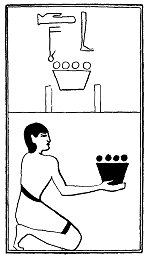

  
[Intangible Textual Heritage](../../index)  [Egypt](../index.md) 
[Index](index)  [Previous](lfo050)  [Next](lfo052.md) 

------------------------------------------------------------------------

### THE FIFTY-SECOND CEREMONY.

Two vessels of Bet incense, with the formula:

"Osiris Unas, the Eye of Horus hath been presented unto thee that it may
purify for thee thy mouth."

 

   
The Sem priest presenting two vessels of Bet incense.

 

------------------------------------------------------------------------

[Next: The Fifty-third Ceremony](lfo052.md)
