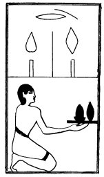

  
[Intangible Textual Heritage](../../index)  [Egypt](../index.md) 
[Index](index)  [Previous](lfo051)  [Next](lfo053.md) 

------------------------------------------------------------------------

p. 112

### THE FIFTY-THIRD CEREMONY.

A Tua cake and a Shens cake as an Ush offering, with the formula:--

"Osiris Unas, the Eye of Horus hath been presented unto thee, and it
hath been offered unto thee for thy mouth."

 

   
The Sem priest presenting the Tua cake and the Shens cake.

 

------------------------------------------------------------------------

[Next: The Fifty-fourth Ceremony](lfo053.md)
