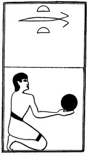

  
[Intangible Textual Heritage](../../index)  [Egypt](../index) 
[Index](index)  [Previous](lfo053)  [Next](lfo055) 

------------------------------------------------------------------------

p. 113

### THE FIFTY-FIFTH CEREMONY.

A Rethu cake, with the formula:--

"Osiris Unas, the Eye of Horus, which was put under restraint by him
(i.e., by Set), hath been presented unto thee."

 

   
The Sem priest presenting a Rethu cake.

 

------------------------------------------------------------------------

[Next: The Fifty-sixth Ceremony](lfo055)
